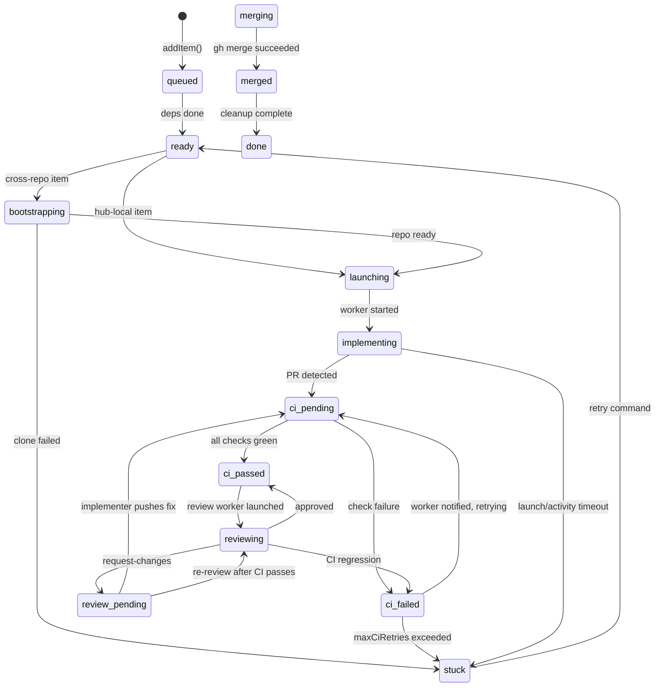

# ninthwave Architecture

A reference for contributors who want to understand how the pieces fit together before diving into code.

See also: [CONTRIBUTING.md](CONTRIBUTING.md) for development setup and coding conventions.

---

## Table of Contents

1. [Orchestrator State Machine](#orchestrator-state-machine)
2. [Data Flow](#data-flow)
3. [Key Abstractions](#key-abstractions)
4. [Extension Points](#extension-points)
5. [Worker Lifecycle](#worker-lifecycle)
6. [Repo Reference Identity](#repo-reference-identity)

---

## Orchestrator State Machine

Each work item moves through a state machine defined in [`core/orchestrator.ts`](core/orchestrator.ts). The `processTransitions` function is pure -- it takes a poll snapshot and returns actions to execute; no side effects.

### States

| State | Description |
|-------|-------------|
| `queued` | Added to orchestration; waiting for dependencies to complete |
| `ready` | Dependencies done; waiting for a WIP slot |
| `bootstrapping` | Cross-repo target being cloned/initialised |
| `launching` | Worktree created, AI session being started |
| `implementing` | Worker is active and coding |
| `ci-pending` | PR created; CI checks running (or awaiting CI start) |
| `ci-passed` | CI green; ready to merge (or review) |
| `ci-failed` | CI red; worker being notified |
| `repairing` | CI-fix worker active (direct repair mode) |
| `review-pending` | Awaiting review worker launch |
| `reviewing` | Review worker active (tracked via separate `reviewSessionLimit`) |
| `merging` | Merge in progress |
| `merged` | PR merged |
| `forward-fix-pending` | Post-merge CI check pending |
| `fix-forward-failed` | Post-merge CI failed; forward-fixer being launched |
| `fixing-forward` | Forward-fixer worker fixing a broken main branch |
| `done` | Cleanup complete |
| `stuck` | Max retries exhausted or unrecoverable failure |

### Transition Diagram



### WIP Limit

States that count toward the WIP limit (see `OrchestratorConfig.sessionLimit`): `bootstrapping`, `launching`, `implementing`, `ci-pending`, `ci-passed`, `ci-failed`, `repairing`, `review-pending`, `merging`. Review workers (`reviewing`) have a separate limit (`reviewSessionLimit`).

### Stacked Launches

When `enableStacking=true`, an item whose only in-flight dependency is in a "stackable" state (`ci-passed`, `review-pending`, `merging`) can launch early against the dep's branch rather than waiting for the dep to fully merge. See `STACKABLE_STATES` in `core/orchestrator.ts`.

---

## Data Flow

```
User runs /decompose
  └─→ skill explores codebase, writes .ninthwave/work/*.md (one file per work item)

User runs nw
  └─→ CLI handles selection/settings, then launches orchestration
      ├─ git worktree create .ninthwave/.worktrees/ninthwave-<ID>
      ├─ allocate partition (port/DB isolation) via core/partitions.ts
      ├─ seed agent files into worktree (core/commands/launch.ts seedAgentFiles)
      └─ launch AI session in multiplexer workspace, send worker prompt

Worker session (per work item)
  ├─ reads project CLAUDE.md / AGENTS.md for conventions
  ├─ implements the work item, runs tests
  ├─ git push → gh pr create
  └─ idles, waiting for orchestrator messages

nw (orchestrator event loop, ~10s poll)
  ├─ poll GitHub for PR/CI/review status (core/commands/orchestrate.ts)
  ├─ poll multiplexer for worker liveness (core/mux.ts readScreen)
  ├─ run processTransitions (pure state machine → list of Actions)
  ├─ executeAction for each action:
  │   ├─ launch   → launch.ts launchSingleItem
  │   ├─ merge    → gh.ts prMerge
  │   ├─ notify-ci-failure  → mux.sendMessage to worker
  │   ├─ notify-review      → mux.sendMessage to worker
  │   ├─ rebase   → git.ts daemonRebase
  │   ├─ clean    → clean.ts cleanSingleWorktree
  │   └─ launch-review → launch.ts launchReviewWorker

Post-merge
  ├─ if merge-commit CI fails, forward-fixer launches and chooses the smallest safe repair PR
  │   (fix-forward, disable a newly introduced feature flag, or revert)
  ├─ worktree and workspace cleaned up
  ├─ work item file removed from .ninthwave/work/
  ├─ stacked dependents retargeted to main
  └─ version bump deferred until all items done
```

Key files: [`core/parser.ts`](core/parser.ts) (read work items), [`core/commands/launch.ts`](core/commands/launch.ts) (launch), [`core/commands/orchestrate.ts`](core/commands/orchestrate.ts) (event loop), [`core/commands/clean.ts`](core/commands/clean.ts) (cleanup).

---

## Key Abstractions

### `Multiplexer` -- `core/mux.ts`

Abstracts terminal multiplexer operations behind a clean interface.

```typescript
interface Multiplexer {
  readonly type: MuxType;                                           // "cmux" | "tmux"
  isAvailable(): boolean;
  diagnoseUnavailable(): string;
  launchWorkspace(cwd: string, command: string, workItemId?: string): string | null;
  splitPane(command: string): string | null;
  sendMessage(ref: string, message: string): boolean;
  readScreen(ref: string, lines?: number): string;
  listWorkspaces(): string;
  closeWorkspace(ref: string): boolean;
  setStatus(ref: string, key: string, text: string, icon: string, color: string): boolean;
  setProgress(ref: string, value: number, label?: string): boolean;
}
```

Shipped implementations:

- `CmuxAdapter` -- wraps the cmux CLI. Workspace refs look like `workspace:1`. cmux supports sidebar-oriented status/progress updates, but it must be used from inside an active cmux session.
- `TmuxAdapter` -- wraps tmux using a **windows-within-session** model: one tmux session per project, one `nw_<workItemId>` window per worker. Refs use tmux's `session:window` target syntax, typically `{session}:nw_<ID>` (that is, the `{session}:nw:{workItemId}` worker identity encoded as a tmux window target). Message delivery is paste-then-submit: `tmux load-buffer -`, `tmux paste-buffer`, then `tmux send-keys Enter`.

### Multiplexer Detection Chain

`detectMuxType()` and `checkAutoLaunch()` share the same six-step preference order:

1. `NINTHWAVE_MUX` override (`tmux` or `cmux`) -- invalid values warn and fall through.
2. `CMUX_WORKSPACE_ID` -- if present, stay on cmux because the user is already inside a cmux workspace.
3. `$TMUX` -- if present, stay on tmux because the user is already inside a tmux session.
4. Installed `tmux` binary -- preferred over cmux when the user is **not** already inside a multiplexer session, because tmux can create/manage its own project session.
5. Installed `cmux` binary -- usable for detection, but launch-time checks still require the user to actually be inside cmux.
6. Error -- no supported multiplexer available.

### iTerm2 + tmux

tmux works especially well with iTerm2's control mode (`tmux -CC`). In that mode, tmux windows are rendered as native iTerm2 tabs, so ninthwave workers launched by `TmuxAdapter` show up as normal-looking iTerm2 tabs while still being managed through tmux session/window refs.

---

## Extension Points

### Adding a New Multiplexer Adapter

> **Note:** cmux and tmux are both shipped adapters. The Multiplexer interface remains extensible for community adapters beyond those two backends.

1. Add your type to `MuxType` in `core/mux.ts`:
   ```typescript
   export type MuxType = "cmux" | "mymux";
   ```
2. Implement the `Multiplexer` interface as a new adapter class (follow `CmuxAdapter` and `TmuxAdapter` as templates).
3. Add detection logic in `detectMuxType()` and any launch-gating needed in `checkAutoLaunch()`.
4. Add a case in `getMux()` to return the new adapter.
5. Add tests in `test/mux.test.ts`.

### Adding a New CLI Command

1. Create `core/commands/mycommand.ts` and export a `cmdMyCommand(args: string[])` function.
2. Import and route it in `core/cli.ts`:
   ```typescript
   import { cmdMyCommand } from "./commands/mycommand.ts";
   // ...inside the arg-switch:
   case "mycommand":
     cmdMyCommand(args);
     break;
   ```
3. Add a help entry to the `COMMANDS` array in `core/cli.ts`:
   ```typescript
   ["mycommand [--flag]", "One-line description"],
   ```
4. Add tests in `test/mycommand.test.ts`.

---

---

## Worker Lifecycle

Each work item gets an isolated AI coding session managed as follows:

### Launch

`launchSingleItem()` in [`core/commands/launch.ts`](core/commands/launch.ts):

1. Create an isolated git worktree and item branch for the worker.
2. `allocatePartition(id)` -- assigns a unique port range and DB prefix for test isolation.
3. `seedAgentFiles(worktreePath, hubRoot)` -- copies `implementer.md` to `.claude/agents/`, `.opencode/agents/`, `.github/agents/` inside the worktree.
4. `mux.launchWorkspace(worktreePath, command, workItemId)` -- spawns the session; returns a workspace ref (e.g., `"workspace:1"` for cmux, `"{session}:nw_<ID>"` for tmux).
5. `sendWithReadyWait(mux, ref, prompt, ...)` -- waits for the AI prompt, sends the implementer instructions, verifies the worker starts processing.

The workspace ref is stored in `OrchestratorItem.workspaceRef` for later messaging and cleanup.

### Heartbeat and Health

The orchestrator tracks two signals per worker:

- **Commit freshness** (`lastCommitTime`): timestamp of the most recent commit on `ninthwave/<ID>`. A worker with recent commits is considered active regardless of screen state.
- **Screen health** (`ScreenHealthStatus`): classified by `computeScreenHealth()` in [`core/worker-health.ts`](core/worker-health.ts). Categories: `healthy`, `stalled-empty`, `stalled-permission`, `stalled-error`, `stalled-unchanged`.

Timeout thresholds (configurable via `OrchestratorConfig`): 30 minutes for a worker with no commits since launch (`launchTimeoutMs`), 60 minutes for a worker with stale commits (`activityTimeoutMs`).

### Cleanup

`cleanSingleWorktree(id, ...)` in [`core/commands/clean.ts`](core/commands/clean.ts):

1. `mux.closeWorkspace(workspaceRef)` -- closes the terminal session.
2. `git worktree remove .ninthwave/.worktrees/ninthwave-<ID>` -- removes the checkout.
3. `releasePartition(id)` -- frees the port/DB allocation.

---

## Terminology

`work item` is the canonical term across the current product, code, and docs.

---

## Repo Reference Identity

`core/repo-ref.ts` defines the shared repo identity rules used by client and broker code.

- `normalizeRepoUrl()` strips transport details (SSH vs HTTPS), auth, trailing slashes, and `.git`, then normalizes equivalent references to one host-and-path form such as `github.com/org/repo`.
- `hashRepoUrl()` and `hashNormalizedRepoUrl()` derive the stable SHA-256 repo identity persisted as `repoHash`/`repoRef`.
- `resolveRepoRef()` accepts any supported identity input (`repoUrl`, `repoHash`, or stored `repoRef`), validates consistency when more than one is present, and returns one canonical comparison value.
- `compareRepoRefs()` gives later join and runtime checks a shared primitive for rejecting cross-repo mismatches without duplicating normalization logic.
