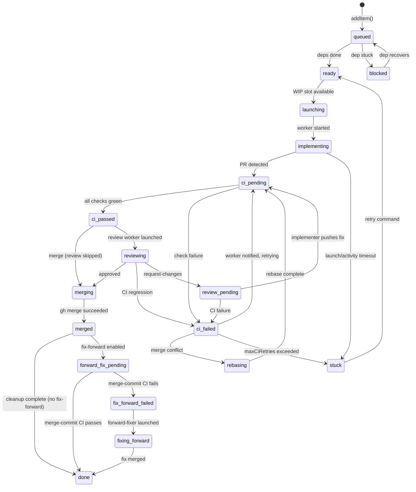

# ninthwave Architecture

A reference for contributors who want to understand how the pieces fit together before diving into code.

See also: [CONTRIBUTING.md](CONTRIBUTING.md) for development setup and coding conventions.

---

## Table of Contents

1. [Orchestrator State Machine](#orchestrator-state-machine)
2. [Data Flow](#data-flow)
3. [Key Abstractions](#key-abstractions)
4. [Guard Registry](#guard-registry)
5. [Request Queue](#request-queue)
6. [Bundled OrchestratorDeps](#bundled-orchestratordeps)
7. [Extension Points](#extension-points)
8. [Worker Lifecycle](#worker-lifecycle)
9. [Module Inventory](#module-inventory)
10. [Repo Reference Identity](#repo-reference-identity)

---

## Orchestrator State Machine

Each work item moves through a state machine defined in [`core/orchestrator.ts`](core/orchestrator.ts). The `processTransitions` function is pure -- it takes a poll snapshot and returns actions to execute; no side effects. Actions are executed by standalone functions in [`core/orchestrator-actions.ts`](core/orchestrator-actions.ts). Temporal safety checks use pure predicates from [`core/orchestrator-guards.ts`](core/orchestrator-guards.ts).

### States

| State | Description |
|-------|-------------|
| `queued` | Added to orchestration; waiting for dependencies to complete |
| `ready` | Dependencies done; waiting for a WIP slot |
| `launching` | Worktree created, AI session being started |
| `implementing` | Worker is active and coding |
| `ci-pending` | PR created; CI checks running (or awaiting CI start) |
| `ci-passed` | CI green; ready to merge (or review) |
| `ci-failed` | CI red; worker being notified |
| `rebasing` | Rebaser worker resolving merge conflicts |
| `review-pending` | Awaiting review worker launch |
| `reviewing` | Review worker active (tracked via separate `reviewSessionLimit`) |
| `merging` | Merge in progress |
| `merged` | PR merged |
| `forward-fix-pending` | Post-merge CI check pending |
| `fix-forward-failed` | Post-merge CI failed; forward-fixer being launched |
| `fixing-forward` | Forward-fixer worker fixing a broken main branch |
| `done` | Cleanup complete |
| `blocked` | Dependency is stuck; waiting for resolution |
| `stuck` | Max retries exhausted or unrecoverable failure |

### Transition Diagram



### WIP Limit

States that count toward the WIP limit (see `OrchestratorConfig.sessionLimit`): `launching`, `implementing`, `ci-pending`, `ci-passed`, `ci-failed`, `rebasing`, `review-pending`, `merging`. Review workers (`reviewing`) have a separate limit (`reviewSessionLimit`).

### Runtime Transition Enforcement

Every state change goes through `Orchestrator.transition()`, which validates the move against the `STATE_TRANSITIONS` table in [`core/orchestrator-types.ts`](core/orchestrator-types.ts). If the target state is not in the allowed list for the current state, `transition()` throws immediately -- surfacing programming errors instead of silently producing impossible state sequences.

`transition()` also manages per-transition bookkeeping: clearing `rebaseRequested` and timeout state, recording `ciPendingSince` for the stale-CI grace period, and running declarative side-effect hooks from `TRANSITION_SIDE_EFFECTS`.

`hydrateState()` is the counterpart for crash recovery and state reconstruction. It sets `item.state` directly, bypassing validation, flag management, and callbacks. This is correct because hydrated state comes from persisted data or inferred external state (merged PRs, CI status), not from handler logic.

### Stacked Launches

When `enableStacking=true`, an item whose only in-flight dependency is in a "stackable" state (`ci-passed`, `reviewing`, `review-pending`, `merging`) can launch early against the dep's branch rather than waiting for the dep to fully merge. See `STACKABLE_STATES` in `core/orchestrator-types.ts`.

---

## Data Flow

```
User runs /decompose
  └─→ skill explores codebase, writes .ninthwave/work/*.md (one file per work item)

User runs nw
  └─→ CLI handles selection/settings, then launches orchestration
      ├─ git worktree create .ninthwave/.worktrees/ninthwave-<ID>
      ├─ allocate partition (port/DB isolation) via core/partitions.ts
      ├─ seed agent files into worktree (core/commands/launch.ts seedAgentFiles)
      └─ launch AI session in multiplexer workspace, send worker prompt

Worker session (per work item)
  ├─ reads project CLAUDE.md / AGENTS.md for conventions
  ├─ implements the work item, runs tests
  ├─ git push → gh pr create
  └─ idles, waiting for orchestrator messages

nw (orchestrator event loop, ~10s poll)
  ├─ build snapshot: poll GitHub for PR/CI/review status
  │   ├─ buildSnapshotAsync dispatches item polls in parallel through the RequestQueue
  │   ├─ priority ordering: merging (critical) > ci-failed (high) > ci-pending/reviewing (normal) > implementing (low)
  │   ├─ concurrency capped by queue semaphore (default 6)
  │   └─ per-item error isolation (one failed poll does not block others)
  ├─ poll multiplexer for worker liveness (core/mux.ts readScreen)
  ├─ run processTransitions (pure state machine → list of Actions)
  ├─ executeAction for each action (core/orchestrator-actions.ts):
  │   ├─ launch   → launch.ts launchSingleItem
  │   ├─ merge    → gh.ts prMerge
  │   ├─ notify-ci-failure  → mux.sendMessage to worker
  │   ├─ notify-review      → mux.sendMessage to worker
  │   ├─ rebase   → git.ts daemonRebase
  │   ├─ clean    → clean.ts cleanSingleWorktree
  │   └─ launch-review → launch.ts launchReviewWorker

Post-merge
  ├─ if merge-commit CI fails, forward-fixer launches and chooses the smallest safe repair PR
  │   (fix-forward, disable a newly introduced feature flag, or revert)
  ├─ worktree and workspace cleaned up
  ├─ work item file removed from .ninthwave/work/
  ├─ stacked dependents retargeted to main
  └─ version bump deferred until all items done
```

Key files: [`core/parser.ts`](core/parser.ts) (read work items), [`core/commands/launch.ts`](core/commands/launch.ts) (launch), [`core/commands/orchestrate.ts`](core/commands/orchestrate.ts) (event loop), [`core/orchestrator-actions.ts`](core/orchestrator-actions.ts) (action execution), [`core/snapshot.ts`](core/snapshot.ts) (snapshot building), [`core/request-queue.ts`](core/request-queue.ts) (rate limiting and concurrency), [`core/commands/clean.ts`](core/commands/clean.ts) (cleanup).

---

## Key Abstractions

### `Multiplexer` -- `core/mux.ts`

Abstracts terminal multiplexer operations behind a clean interface.

```typescript
interface Multiplexer {
  readonly type: MuxType;                                           // "cmux" | "tmux" | "headless"
  isAvailable(): boolean;
  diagnoseUnavailable(): string;
  launchWorkspace(cwd: string, command: string, workItemId?: string): string | null;
  splitPane(command: string): string | null;
  sendMessage(ref: string, message: string): boolean;
  readScreen(ref: string, lines?: number): string;
  listWorkspaces(): string;
  closeWorkspace(ref: string): boolean;
  setStatus(ref: string, key: string, text: string, icon: string, color: string): boolean;
  setProgress(ref: string, value: number, label?: string): boolean;
}
```

Shipped implementations:

- `CmuxAdapter` -- wraps the cmux CLI. Workspace refs look like `workspace:1`. cmux supports sidebar-oriented status/progress updates, but it must be used from inside an active cmux session.
- `TmuxAdapter` -- wraps tmux using a **windows-within-session** model: one tmux session per project, one `nw_<workItemId>` window per worker. Refs use tmux's `session:window` target syntax, typically `{session}:nw_<ID>` (that is, the `{session}:nw:{workItemId}` worker identity encoded as a tmux window target). Message delivery is paste-then-submit: `tmux load-buffer -`, `tmux paste-buffer`, then `tmux send-keys Enter`.
- `HeadlessAdapter` -- fallback when no terminal multiplexer is available. Used for headless/remote execution. Workspace refs use `%<ID>` format.

### Multiplexer Detection Chain

`detectMuxType()` and `checkAutoLaunch()` share the same six-step preference order:

1. `NINTHWAVE_MUX` override (`tmux`, `cmux`, or `headless`) -- invalid values warn and fall through.
2. `CMUX_WORKSPACE_ID` -- if present, stay on cmux because the user is already inside a cmux workspace.
3. `$TMUX` -- if present, stay on tmux because the user is already inside a tmux session.
4. Installed `tmux` binary -- preferred over cmux when the user is **not** already inside a multiplexer session, because tmux can create/manage its own project session.
5. Installed `cmux` binary -- usable for detection, but launch-time checks still require the user to actually be inside cmux.
6. Headless fallback -- when no multiplexer is detected, falls back to `HeadlessAdapter`.

### iTerm2 + tmux

tmux works especially well with iTerm2's control mode (`tmux -CC`). In that mode, tmux windows are rendered as native iTerm2 tabs, so ninthwave workers launched by `TmuxAdapter` show up as normal-looking iTerm2 tabs while still being managed through tmux session/window refs.

---

## Guard Registry

[`core/orchestrator-guards.ts`](core/orchestrator-guards.ts) exports pure temporal safety predicates used by the state machine handlers. Each guard is a pure function of timestamps, config thresholds, and the current time -- no side effects, no state mutation, trivially testable.

### Signal Freshness Contract

Every handler that reads a snapshot field with temporal significance (`ciStatus`, `reviewDecision`, `isMergeable`) must consider staleness. The guards encode this contract:

| Guard | Purpose |
|-------|---------|
| `isCiFailTrustworthy` | CI "fail" grace period -- returns true only after enough time has elapsed since entering `ci-pending` that a failure can be trusted (not stale from a previous commit) |
| `isHeartbeatActive` | Heartbeat freshness -- returns true when a heartbeat timestamp exists and is within the timeout window |
| `isEventFresherThan` | Event freshness -- checks if a snapshot event time is newer than a baseline (e.g., post-rebase push) |
| `shouldRenotifyCiFailure` | Re-notification guard -- true when a new commit has arrived since the last CI failure notification |
| `isActivityTimedOut` | Activity timeout -- worker idle (no new commits) beyond threshold |
| `isLaunchTimedOut` | Launch timeout -- worker failed to show signs of life within launch window |
| `isCiFixAckTimedOut` | CI fix acknowledgment timeout -- worker did not heartbeat after CI failure notification |
| `isMergeCiGracePeriodExpired` | Merge CI grace period -- enough time for CI to report on the merge commit |
| `isRebaseStale` | Rebase nudge staleness -- should we re-nudge a rebase? |

Guards relate to grace periods and timeouts by encoding the "is it safe to act?" question. Handlers call the relevant guard before making transition decisions, ensuring the orchestrator does not act on stale or premature signals.

---

## Request Queue

[`core/request-queue.ts`](core/request-queue.ts) provides centralized GitHub API request management with two layers of flow control: token bucket rate limiting and priority-based concurrency control. It replaced the earlier reactive `RateLimitBackoff` approach with proactive rate management.

### Token Bucket Rate Limiting

The `TokenBucket` targets 85% of GitHub's 5000 requests/hour limit (~4250/hr, ~1.18 tokens/sec) to stay well under the ceiling and avoid reactive throttling. It syncs with actual GitHub rate limit headers via `updateBudget()`, adjusting its internal token count to reflect the real remaining budget.

Exempt categories (e.g., `rate-limit-query`) bypass token consumption so the queue can check its own rate limit status without consuming budget.

### Priority-Based Concurrency

The `PrioritySemaphore` limits concurrent in-flight requests (default: 6). When all slots are occupied, waiters are queued and served in priority order:

| Priority | Used For |
|----------|----------|
| `critical` | Merging items (need fastest CI feedback) |
| `high` | CI-failed items (worker waiting to be notified) |
| `normal` | CI-pending, reviewing, rebasing, and other active states |
| `low` | Implementing, launching (PR not yet created) |

The mapping from orchestrator state to request priority is defined in `stateToPollingPriority()` in [`core/snapshot.ts`](core/snapshot.ts).

### Audit Logging and Metrics

Every completed request is logged via the injected `log()` callback with category, item ID, latency, and success/failure. `getStats()` returns per-category metrics (count, average latency, failure count) and overall budget utilization, enabling the TUI to surface queue health.

---

## Bundled OrchestratorDeps

[`core/orchestrator-types.ts`](core/orchestrator-types.ts) defines `OrchestratorDeps` as a bundle of six sub-interfaces, grouped by concern:

| Sub-interface | Concern | Key Operations |
|---------------|---------|----------------|
| `GitDeps` | Git operations | `fetchOrigin`, `ffMerge`, `daemonRebase`, `rebaseOnto`, `forcePush` |
| `GhDeps` | GitHub API | `prMerge`, `prComment`, `setCommitStatus`, `checkCommitCI`, `retargetPrBase` |
| `MuxDeps` | Multiplexer | `sendMessage`, `closeWorkspace`, `readScreen` |
| `WorkerDeps` | Worker lifecycle | `launchSingleItem`, `launchReview`, `launchRebaser`, `launchForwardFixer` |
| `CleanupDeps` | Cleanup | `cleanSingleWorktree`, `cleanReview`, `cleanRebaser`, `completeMergedWorkItem` |
| `IoDeps` | I/O | `writeInbox`, `warn`, `syncStackComments` |

Action functions in [`core/orchestrator-actions.ts`](core/orchestrator-actions.ts) access deps through typed sub-interface paths (e.g., `deps.gh.prMerge`, `deps.io.writeInbox`). This makes it immediately visible which capabilities each action depends on and enables focused test doubles -- a test for a merge action only needs to stub `deps.gh` and `deps.cleanup`, not all six sub-interfaces.

---

## Extension Points

### Adding a New Multiplexer Adapter

> **Note:** cmux and tmux are both shipped adapters. The Multiplexer interface remains extensible for community adapters beyond those two backends.

1. Add your type to `MuxType` in `core/mux.ts`:
   ```typescript
   export type MuxType = "cmux" | "mymux";
   ```
2. Implement the `Multiplexer` interface as a new adapter class (follow `CmuxAdapter` and `TmuxAdapter` as templates).
3. Add detection logic in `detectMuxType()` and any launch-gating needed in `checkAutoLaunch()`.
4. Add a case in `getMux()` to return the new adapter.
5. Add tests in `test/mux.test.ts`.

### Adding a New CLI Command

1. Create `core/commands/mycommand.ts` and export a `cmdMyCommand(args: string[])` function.
2. Import and route it in `core/cli.ts`:
   ```typescript
   import { cmdMyCommand } from "./commands/mycommand.ts";
   // ...inside the arg-switch:
   case "mycommand":
     cmdMyCommand(args);
     break;
   ```
3. Add a `CommandEntry` to `COMMAND_REGISTRY` in `core/help.ts`:
   ```typescript
   {
     name: "mycommand",
     usage: "mycommand [--flag]",
     description: "One-line description",
     group: "Advanced",
     needsRoot: true,
     handler: (ctx) => cmdMyCommand(ctx.args),
   },
   ```
4. Add tests in `test/mycommand.test.ts`.

---

## Worker Lifecycle

Each work item gets an isolated AI coding session managed as follows:

### Launch

`launchSingleItem()` in [`core/commands/launch.ts`](core/commands/launch.ts):

1. Create an isolated git worktree and item branch for the worker.
2. `allocatePartition(id)` -- assigns a unique port range and DB prefix for test isolation.
3. `seedAgentFiles(worktreePath, hubRoot)` -- copies `implementer.md` to `.claude/agents/`, `.opencode/agents/`, `.github/agents/` inside the worktree.
4. `mux.launchWorkspace(worktreePath, command, workItemId)` -- spawns the session; returns a workspace ref (e.g., `"workspace:1"` for cmux, `"{session}:nw_<ID>"` for tmux).
5. `sendWithReadyWait(mux, ref, prompt, ...)` -- waits for the AI prompt, sends the implementer instructions, verifies the worker starts processing.

The workspace ref is stored in `OrchestratorItem.workspaceRef` for later messaging and cleanup.

### Heartbeat and Health

The orchestrator tracks multiple signals per worker:

- **Worker liveness** (`workerAlive`): determined by `isWorkerAliveWithCache()` in [`core/snapshot.ts`](core/snapshot.ts). Checks whether the worker's workspace ref appears in the multiplexer's workspace listing. Debounced via `notAliveCount` (3 consecutive not-alive checks required before declaring dead).
- **Commit freshness** (`lastCommitTime`): timestamp of the most recent commit on `ninthwave/<ID>`. A worker with recent commits is considered active.
- **Heartbeat** (`lastHeartbeat`): worker progress file with timestamp. A fresh heartbeat (< 5 min) suppresses all timeout checks.

Timeout thresholds (configurable via `OrchestratorConfig`): 30 minutes for a worker with no commits since launch (`launchTimeoutMs`), 60 minutes for a worker with stale commits (`activityTimeoutMs`).

### Cleanup

`cleanSingleWorktree(id, ...)` in [`core/commands/clean.ts`](core/commands/clean.ts):

1. `mux.closeWorkspace(workspaceRef)` -- closes the terminal session.
2. `git worktree remove .ninthwave/.worktrees/ninthwave-<ID>` -- removes the checkout.
3. `releasePartition(id)` -- frees the port/DB allocation.

---

## Terminology

`work item` is the canonical term across the current product, code, and docs.

---

## Module Inventory

Core orchestrator modules and their roles:

| Module | LOC | Role |
|--------|-----|------|
| [`core/orchestrator.ts`](core/orchestrator.ts) | | Orchestrator class: state machine, `processTransitions()`, `transition()`, `hydrateState()` |
| [`core/orchestrator-types.ts`](core/orchestrator-types.ts) | | Type definitions: `OrchestratorItem`, `OrchestratorDeps`, `STATE_TRANSITIONS`, sub-interfaces |
| [`core/orchestrator-actions.ts`](core/orchestrator-actions.ts) | ~1,278 | Action execution functions extracted from the Orchestrator class. Imports only from `orchestrator-types.ts` (no circular deps). |
| [`core/orchestrator-guards.ts`](core/orchestrator-guards.ts) | ~127 | Pure temporal safety predicates (CI trust, heartbeat freshness, timeouts) |
| [`core/request-queue.ts`](core/request-queue.ts) | ~372 | Token bucket rate limiting, priority semaphore, audit logging |
| [`core/snapshot.ts`](core/snapshot.ts) | | Snapshot building: `buildSnapshot` (sync), `buildSnapshotAsync` (parallel via `RequestQueue`) |
| [`core/orchestrate-event-loop.ts`](core/orchestrate-event-loop.ts) | | Event loop: poll cycle, action dispatch, TUI/JSON mode |
| [`core/commands/orchestrate.ts`](core/commands/orchestrate.ts) | | CLI command handler for `nw`, wires deps and launches the event loop |
| [`core/mux.ts`](core/mux.ts) | | Multiplexer abstraction and adapter implementations |
| [`core/parser.ts`](core/parser.ts) | | Reads `.ninthwave/work/` directory and domain normalization |
| [`core/commands/launch.ts`](core/commands/launch.ts) | | Worker launch: worktree creation, partition allocation, agent seeding |
| [`core/commands/clean.ts`](core/commands/clean.ts) | | Cleanup: worktree removal, partition release, workspace close |
| [`core/reconstruct.ts`](core/reconstruct.ts) | | Crash recovery: reconstructs orchestrator state from git/GitHub signals |
| [`core/daemon.ts`](core/daemon.ts) | | Heartbeat file I/O and daemon utilities |
| [`core/repo-ref.ts`](core/repo-ref.ts) | | Shared repo identity: URL normalization, hashing, comparison |
| [`core/broker-state.ts`](core/broker-state.ts) | | Pure broker state machine (claim, sync, complete, scheduling) |
| [`core/broker-store.ts`](core/broker-store.ts) | | Broker storage interfaces (`InMemoryBrokerStore`, `FileBrokerStore`) |
| [`core/broker-server.ts`](core/broker-server.ts) | | Self-hosted broker runtime (HTTP+WebSocket server) |

Notable removals: `core/rate-limit-backoff.ts` -- reactive rate limit backoff, replaced by the proactive `RequestQueue`.

---

## Crew Broker

The broker coordinates work-item scheduling across multiple `nw` daemons in a crew. The protocol surface (sync, claim, complete, heartbeat, schedule-claim) is defined once in shared modules and consumed by two runtimes.

### Broker-Core + Runtime Split

| Module | Role |
|--------|------|
| `core/broker-state.ts` | Pure state-machine functions (claim, sync, complete, heartbeat checks, author-affinity scheduling). No I/O. |
| `core/broker-store.ts` | Storage interfaces and implementations: `InMemoryBrokerStore` (used by the in-process mock broker and tests) and `FileBrokerStore` (used by the self-hosted broker for JSON-file persistence). |
| `core/mock-broker.ts` | In-process mock broker (`MockBroker`). Ephemeral, in-memory, started automatically by the orchestrator when crew mode is active and the daemon connects to the hosted service or needs a local test surface. |
| `core/broker-server.ts` | Self-hosted broker runtime (`BrokerServer`). Long-running Bun HTTP+WebSocket server with file-backed persistence and repo-reference enforcement. Started via `nw broker`. |
| `core/commands/broker.ts` | CLI command handler. Parses `--host`, `--port`, `--data-dir`, `--event-log`, and `--save-crew-url` flags, starts the `BrokerServer`, and optionally persists the broker URL as `crew_url` in project config. |

Both runtimes delegate all scheduling decisions to `broker-state.ts`. The difference is lifecycle and persistence:

- **MockBroker** -- starts and stops with the orchestrator process, state lives in memory.
- **BrokerServer** -- runs independently (`nw broker`), persists crew state to `<data-dir>/<code>.json`, and enforces repo-reference matching on WebSocket connect.

### `crew_url` Configuration

By default, `nw` connects to the hosted broker at `wss://ninthwave.sh`. To point a project at a self-hosted broker instead:

```bash
nw broker --save-crew-url          # starts the broker and writes crew_url to .ninthwave/config.json
```

Or set it manually in `.ninthwave/config.json`:

```json
{ "crew_url": "ws://your-host:4444" }
```

The orchestrator resolves `crew_url` at startup: CLI `--crew-url` flag > project config > hosted default (`wss://ninthwave.sh`).

### Repo-Reference Verification

When a crew is created with a repo reference, the broker stores the normalized repo identity (`repoRef`). On every subsequent WebSocket connect, the daemon's repo URL/hash is resolved via `core/repo-ref.ts` and compared against the crew's stored `repoRef`. Mismatches are rejected with HTTP 403, preventing cross-project crew joins.

### v1 Non-Goals

The self-hosted broker is intentionally minimal in v1:

- **No TLS termination** -- use a reverse proxy (nginx, Caddy, etc.) for HTTPS/WSS.
- **No authentication** -- access control is via network boundaries; the broker trusts all connections that pass repo-reference verification.
- **No multi-tenant isolation** -- one broker instance per trust boundary.
- **No horizontal scaling** -- single-process, single-node.

---

## Repo Reference Identity

`core/repo-ref.ts` defines the shared repo identity rules used by client and broker code.

- `normalizeRepoUrl()` strips transport details (SSH vs HTTPS), auth, trailing slashes, and `.git`, then normalizes equivalent references to one host-and-path form such as `github.com/org/repo`.
- `hashRepoUrl()` and `hashNormalizedRepoUrl()` derive the stable SHA-256 repo identity persisted as `repoHash`/`repoRef`.
- `resolveRepoRef()` accepts any supported identity input (`repoUrl`, `repoHash`, or stored `repoRef`), validates consistency when more than one is present, and returns one canonical comparison value.
- `compareRepoRefs()` gives later join and runtime checks a shared primitive for rejecting repo mismatches without duplicating normalization logic.
