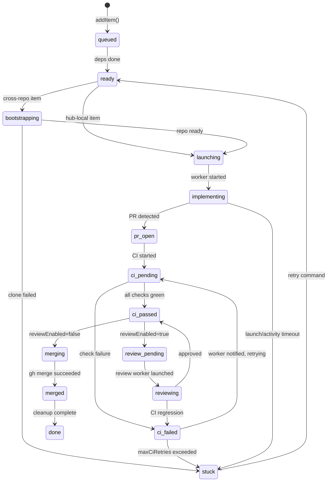

# ninthwave Architecture

A reference for contributors who want to understand how the pieces fit together before diving into code.

See also: [CONTRIBUTING.md](CONTRIBUTING.md) for development setup and coding conventions.

---

## Table of Contents

1. [Orchestrator State Machine](#orchestrator-state-machine)
2. [Data Flow](#data-flow)
3. [Key Abstractions](#key-abstractions)
4. [Extension Points](#extension-points)
5. [Supervisor Architecture](#supervisor-architecture)
6. [Worker Lifecycle](#worker-lifecycle)

---

## Orchestrator State Machine

Each TODO item moves through a state machine defined in [`core/orchestrator.ts`](core/orchestrator.ts). The `processTransitions` function is pure — it takes a poll snapshot and returns actions to execute; no side effects.

### States

| State | Description |
|-------|-------------|
| `queued` | Added to orchestration; waiting for dependencies to complete |
| `ready` | Dependencies done; waiting for a WIP slot |
| `bootstrapping` | Cross-repo target being cloned/initialised |
| `launching` | Worktree created, AI session being started |
| `implementing` | Worker is active and coding |
| `pr-open` | PR created; waiting for CI to start |
| `ci-pending` | CI checks running |
| `ci-passed` | CI green; ready to merge (or review) |
| `ci-failed` | CI red; worker being notified |
| `review-pending` | Awaiting review worker launch |
| `reviewing` | Review worker active |
| `merging` | Merge in progress |
| `merged` | PR merged |
| `done` | Cleanup complete |
| `stuck` | Max retries exhausted or unrecoverable failure |

### Transition Diagram



### WIP Limit

States that count toward the WIP limit (see `OrchestratorConfig.wipLimit`): `launching`, `implementing`, `pr-open`, `ci-pending`, `ci-passed`, `ci-failed`, `review-pending`. Review workers have a separate limit (`reviewWipLimit`).

### Stacked Launches

When `enableStacking=true`, an item whose only in-flight dependency is in a "stackable" state (`implementing`, `pr-open`, `ci-pending`, `ci-passed`, `ci-failed`) can launch early against the dep's branch rather than waiting for the dep to fully merge. See `STACKABLE_STATES` in `core/orchestrator.ts`.

---

## Data Flow

```
User runs /decompose
  └─→ skill explores codebase, writes .ninthwave/todos/*.md (one file per TODO)

User runs /work
  └─→ skill reads .ninthwave/todos/, presents item selection
      └─→ calls ninthwave start <IDs>
            ├─ git worktree create .worktrees/todo-<ID>
            ├─ allocate partition (port/DB isolation) via core/partitions.ts
            ├─ seed agent files into worktree (core/commands/start.ts seedAgentFiles)
            └─ launch AI session in multiplexer workspace, send worker prompt

Worker session (per TODO)
  ├─ reads project CLAUDE.md / AGENTS.md for conventions
  ├─ implements the TODO, runs tests
  ├─ git push → gh pr create
  └─ idles, waiting for orchestrator messages

ninthwave orchestrate (event loop, ~10s poll)
  ├─ poll GitHub for PR/CI/review status (core/commands/watch.ts checkPrStatus)
  ├─ poll multiplexer for worker liveness (core/mux.ts readScreen)
  ├─ run processTransitions (pure state machine → list of Actions)
  ├─ executeAction for each action:
  │   ├─ launch   → start.ts launchSingleItem
  │   ├─ merge    → gh.ts prMerge
  │   ├─ notify-ci-failure  → mux.sendMessage to worker
  │   ├─ notify-review      → mux.sendMessage to worker
  │   ├─ rebase   → git.ts daemonRebase
  │   ├─ clean    → clean.ts cleanSingleWorktree
  │   └─ launch-review → start.ts launchReviewWorker
  └─ every 5min: supervisor heartbeat sent to supervisor session (optional, --supervisor flag)

Post-merge
  ├─ worktree and workspace cleaned up
  ├─ TODO file removed from .ninthwave/todos/
  ├─ stacked dependents retargeted to main
  └─ version bump deferred until all items done
```

Key files: [`core/parser.ts`](core/parser.ts) (read todos), [`core/commands/start.ts`](core/commands/start.ts) (launch), [`core/commands/orchestrate.ts`](core/commands/orchestrate.ts) (event loop), [`core/commands/clean.ts`](core/commands/clean.ts) (cleanup).

---

## Key Abstractions

### `Multiplexer` — `core/mux.ts`

Abstracts terminal multiplexer operations so the orchestrator is not tied to cmux.

```typescript
interface Multiplexer {
  readonly type: MuxType;                                           // "cmux" | "tmux" | "zellij"
  isAvailable(): boolean;
  launchWorkspace(cwd: string, command: string, todoId?: string): string | null;
  sendMessage(ref: string, message: string): boolean;
  readScreen(ref: string, lines?: number): string;
  listWorkspaces(): string;
  closeWorkspace(ref: string): boolean;
}
```

Concrete implementations: `CmuxAdapter`, `TmuxAdapter`, `ZellijAdapter`. Auto-detection via `getMux()` checks `NINTHWAVE_MUX` env var first, then detects the active session type, then falls back by binary availability.

---

## Extension Points

### Adding a New Multiplexer Adapter

1. Add your type to `MuxType` in `core/mux.ts`:
   ```typescript
   export type MuxType = "cmux" | "zellij" | "tmux" | "mymux";
   ```
2. Implement the `Multiplexer` interface as a new class in `core/mux.ts` (follow `TmuxAdapter` as a template).
3. Add detection logic in `detectMuxType()` — check an env var or binary.
4. Add a `case "mymux"` branch in the `getMux()` switch.
5. Add tests in `test/mux.test.ts`.

### Adding a New CLI Command

1. Create `core/commands/mycommand.ts` and export a `cmdMyCommand(args: string[])` function.
2. Import and route it in `core/cli.ts`:
   ```typescript
   import { cmdMyCommand } from "./commands/mycommand.ts";
   // ...inside the arg-switch:
   case "mycommand":
     cmdMyCommand(args);
     break;
   ```
3. Add a help entry to the `COMMANDS` array in `core/cli.ts`:
   ```typescript
   ["mycommand [--flag]", "One-line description"],
   ```
4. Add tests in `test/mycommand.test.ts`.

---

## Supervisor Architecture

The orchestrator has two layers:

### Deterministic Daemon

The core event loop in [`core/commands/orchestrate.ts`](core/commands/orchestrate.ts). Pure TypeScript — no LLM. Runs every ~10 seconds:

1. Poll GitHub (PR state, CI status, review decision) and the multiplexer (worker liveness, screen content).
2. Call `processTransitions()` — the pure state machine returns a list of `Action` objects.
3. Execute each action via `executeAction()` (launch workers, merge PRs, send messages, rebase branches).
4. Persist state to `~/.ninthwave/state/<project>/state.json` for daemon resilience.

The daemon supports two output modes:

- **TUI mode** (default when stdout is a TTY): renders a live status table using [`core/status-render.ts`](core/status-render.ts), with keyboard shortcuts for interacting with the pipeline.
- **JSON mode** (`--json` flag): emits structured JSON log lines, suitable for piping to other tools or CI environments.

The daemon can also run in the background (`--daemon` flag). In daemon mode, state survives restarts.

### Optional LLM Supervisor (Session-Based)

The supervisor runs as a **separate AI session** alongside the daemon, not as an inline LLM call. The agent prompt lives in [`agents/supervisor.md`](agents/supervisor.md); activation logic is in [`core/supervisor.ts`](core/supervisor.ts).

1. The daemon launches a supervisor session via `launchSupervisorSession()` in [`core/commands/start.ts`](core/commands/start.ts).
2. The daemon sends structured event messages to the supervisor session on state transitions and periodic heartbeats (default: every 5 minutes).
3. The supervisor session observes pipeline state, detects anomalies (stalled workers, CI cycling), nudges workers via `cmux send`, and logs friction to `.ninthwave/friction/`.

This session-based approach gives the supervisor full tool access (bash, file I/O, git) and multi-turn reasoning — unlike the previous inline `claude --print` approach which was limited to single-shot responses.

The supervisor is activated explicitly via `--supervisor` flag, or automatically in dogfooding mode (when `skills/work/SKILL.md` exists).

---

## Worker Lifecycle

Each TODO item gets an isolated AI coding session managed as follows:

### Launch

`launchSingleItem()` in [`core/commands/start.ts`](core/commands/start.ts):

1. `git worktree add .worktrees/todo-<ID> -b todo/<ID>` — isolated checkout.
2. `allocatePartition(id)` — assigns a unique port range and DB prefix for test isolation.
3. `seedAgentFiles(worktreePath, hubRoot)` — copies `todo-worker.md` to `.claude/agents/`, `.opencode/agents/`, `.github/agents/` inside the worktree.
4. `mux.launchWorkspace(worktreePath, command, todoId)` — spawns the session; returns a workspace ref (e.g., `"workspace:1"` for cmux, `"nw-H-1-1-3"` for tmux).
5. `sendWithReadyWait(mux, ref, prompt, ...)` — waits for the AI prompt, sends the todo-worker instructions, verifies the worker starts processing.

The workspace ref is stored in `OrchestratorItem.workspaceRef` for later messaging and cleanup.

### Heartbeat and Health

The orchestrator tracks two signals per worker:

- **Commit freshness** (`lastCommitTime`): timestamp of the most recent commit on `todo/<ID>`. A worker with recent commits is considered active regardless of screen state.
- **Screen health** (`ScreenHealthStatus`): classified by `computeScreenHealth()` in [`core/worker-health.ts`](core/worker-health.ts). Categories: `healthy`, `stalled-empty`, `stalled-permission`, `stalled-error`, `stalled-unchanged`.

Timeout thresholds (configurable via `OrchestratorConfig`): 30 minutes for a worker with no commits since launch (`launchTimeoutMs`), 60 minutes for a worker with stale commits (`activityTimeoutMs`).

### Cleanup

`cleanSingleWorktree(id, ...)` in [`core/commands/clean.ts`](core/commands/clean.ts):

1. `mux.closeWorkspace(workspaceRef)` — closes the terminal session.
2. `git worktree remove .worktrees/todo-<ID>` — removes the checkout.
3. `releasePartition(id)` — frees the port/DB allocation.
