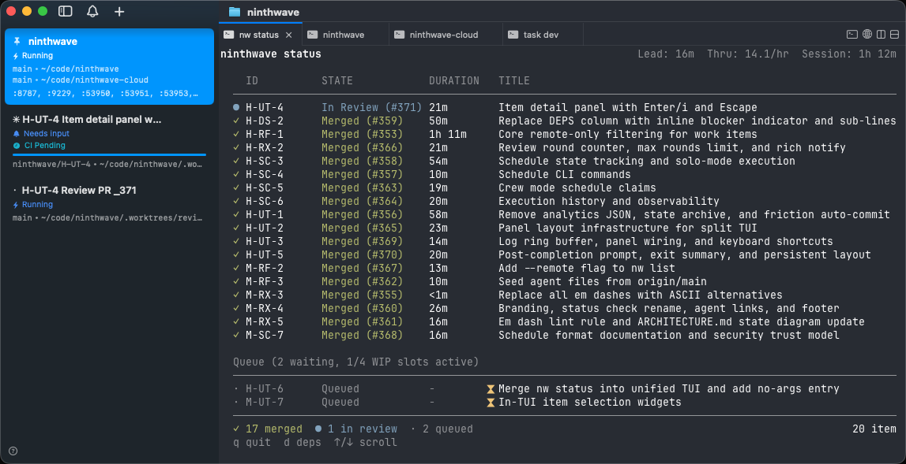

<p align="center">
  <a href="https://ninthwave.sh"></a>
</p>
<h1 align="center">Ninthwave</h1>

<p align="center">
  <strong>Decompose. Run nw. Get merged PRs.</strong>
</p>

<p align="center">
  <a href="https://github.com/ninthwave-sh/ninthwave/stargazers"></a>
  <a href="LICENSE"></a>
  <a href="CHANGELOG.md"></a>
  <a href="https://agentskills.io"></a>
</p>

<p align="center">
  <a href="https://ninthwave.sh"></a>
</p>

Ninthwave orchestrates parallel AI coding sessions from markdown work items.

## How it works

Work items are markdown files in `.ninthwave/work/`. That directory is the live queue of open work, not a permanent tracker: when an item is done, its file is removed so the directory always reflects what is still available or in flight. Use `/decompose` to generate items from a plan, then run `nw` to orchestrate them.

Looking back happens through GitHub PRs, git history, `nw history <ID>` for an item's state timeline, and `nw logs` for orchestration events. The missing `done/` lane is intentional.

Each item gets its own git worktree and a full native instance of [Claude Code](https://docs.anthropic.com/en/docs/claude-code/overview), [OpenCode](https://opencode.ai), [Codex CLI](https://github.com/openai/codex), or [Copilot CLI](https://docs.github.com/en/copilot/how-tos/set-up/install-copilot-cli), which you can jump into and steer.

The orchestrator monitors CI, coordinates between implementer and review agents, external feedback, and merges approved PRs. Dependent items stack as chained PRs - reviewers get clean diffs.

Scale horizontally with tasks brokered by [ninthwave.sh](https://ninthwave.sh) (optional, no registration required, no code shared).

## Install

```bash
brew install ninthwave-sh/tap/ninthwave
```

Requires [gh](https://cli.github.com). Interactive backends are optional: install [tmux](https://github.com/tmux/tmux/wiki) or [cmux](https://cmux.com) if you want attachable terminal sessions, or run headless by default.

Supported AI tools: Claude Code, OpenCode, Codex CLI, and GitHub Copilot CLI. `nw init` manages generated tool artifacts such as `.codex/agents/ninthwave-*.toml`, but project instruction files like `AGENTS.md` remain user-owned inputs that ninthwave does not create or overwrite. For Codex-specific setup details, see [docs/codex-cli.md](docs/codex-cli.md).

## Getting started

Run `nw`, then choose a backend on the startup settings screen:

- `Auto` -- default; stay on your current cmux/tmux session when present, otherwise prefer installed tmux, then cmux, else headless
- `tmux` -- use tmux explicitly, or fall back to headless if tmux is unavailable
- `cmux` -- use cmux explicitly, or fall back to headless if cmux is unavailable
- `headless` -- skip multiplexers and run detached for programmatic/non-interactive use

`tmux` and `cmux` are attachable interactive backends. `headless` is the non-interactive backend.

Your choice is saved as `backend_mode` and becomes the next startup default. For one-off overrides, set `NINTHWAVE_MUX=tmux|cmux|headless`; that takes precedence over the saved default and normal auto-detection.

If you prefer tmux tabs in iTerm2, see [iTerm2 tmux integration](docs/iterm2.md).

After item selection (and AI tool selection when multiple tools are configured), `nw` shows a single startup settings screen before the live status UI. That screen is the pre-status control surface for merge strategy, reviews, collaboration mode, WIP limit, and backend selection.

Merge strategies are CI-first in every mode:

- `manual` -- CI must pass, then a human merges the PR
- `auto` -- CI must pass, then ninthwave auto-merges the PR
- `bypass` -- CI must pass, then ninthwave admin-merges without human approval requirements (`--dangerously-bypass` only)

## License

Apache 2.0. See [LICENSE](LICENSE).
