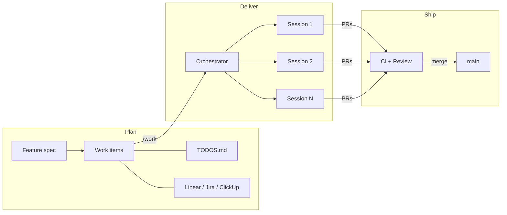

# ninthwave

Ship features through parallel AI sessions. Each work item gets a full interactive coding session — not a sub-agent, not a background task. Bring your own AI tool, CI, and workflow.

<!-- TODO: Add demo GIF/video here showing parallel sessions in action -->



## How It Works

### 1. Plan

Take your PRDs, transcripts, specs — decompose into work items. Output goes to your task management tool, or to `TODOS.md` if you prefer markdown.

Two ways to create work items:
- **Write them yourself** following the [format guide](core/docs/todos-format.md)
- **Use `/decompose`** to break down a feature spec automatically

### 2. Deliver

Run `/work`. ninthwave launches parallel AI coding sessions, monitors CI and reviews, and merges PRs. You review, steer, and approve.

- **Dependency ordering** — work items are grouped into batches by their dependencies; batch N+1 starts after batch N is merged
- **Merge strategies** — merge after approval + CI passes, auto-merge as soon as CI passes, or confirm each merge manually
- **WIP limits** — rate-limit concurrent sessions (e.g., 5 at a time); auto-start next when a PR opens, keeping the pipeline flowing

## Prerequisites

| Dependency | Purpose | Install |
|------------|---------|---------|
| An AI coding tool | Runs the sessions | Claude Code, OpenCode, Copilot CLI, etc. |
| [cmux](https://cmux.com/) | Workspace management, message passing, status updates | `brew install cmux` |
| [gh](https://cli.github.com/) | GitHub CLI for PR operations | `brew install gh` |

Works with Claude Code, OpenCode, Copilot CLI, and any tool supporting the [Agent Skills standard](https://agentskills.io). The tool is auto-detected from the orchestrator's environment.

## Quick Start

**Global install** (recommended — shared across projects):

```bash
git clone https://github.com/roblambell/ninthwave.git ~/.claude/skills/ninthwave
cd /path/to/your/project
~/.claude/skills/ninthwave/setup
```

**Per-project install** (committed to git, shared by the team):

```bash
cd /path/to/your/project
bash <(curl -fsSL https://raw.githubusercontent.com/roblambell/ninthwave/main/remote-install.sh) --local
```

One developer runs setup; the rest get the project-level files via `git pull`. Review with `git diff`, then commit.

## Design Principles

**Your tool, multiplied.** Each session is a full native instance of the AI coding tool you already use — same interface, same capabilities. Switch into any session, steer it mid-flight, or iterate on a PR. ninthwave handles the coordination; you stay in control.

**Bring your own everything.** Your AI tool, your CI, your task management, your coding conventions. ninthwave is the orchestration layer that connects them.

**Cost-conscious.** One orchestrator session + one agent per work item. No agent swarm, no redundant LLM calls.

## What Gets Installed

ninthwave is a **self-contained bundle** — all skills, agents, and the CLI live inside the ninthwave directory. The `setup` script creates minimal project-level config.

**The bundle** (stays in `.claude/skills/ninthwave/` or `~/.claude/skills/ninthwave/`):
- Skills: `/work`, `/decompose`, `/todo-preview`, `/ninthwave-upgrade`
- Worker agent: `todo-worker.md`
- CLI: `core/batch-todos.sh`
- Docs: `core/docs/todos-format.md`

**Project-level files** (created by setup, committed to git):

| Path | Purpose |
|------|---------|
| `.ninthwave/work` | CLI shim — calls the bundle's `core/batch-todos.sh` |
| `.ninthwave/dir` | Points to the ninthwave bundle location |
| `.ninthwave/config` | Project settings (LOC extensions, domain mappings) |
| `.ninthwave/domains.conf` | Custom domain slug mappings |
| `.claude/skills/*` | Symlinks to bundle skills (for discovery) |
| `.claude/agents/todo-worker.md` | Worker agent (Claude Code) |
| `.opencode/agents/todo-worker.md` | Worker agent (OpenCode) |
| `.github/agents/todo-worker.agent.md` | Worker agent (Copilot CLI) |
| `TODOS.md` | Work items (created if missing) |

### Expected skills (bring your own)

Workers reference these skill names during execution. If available, they're used; if not, the worker falls back gracefully.

| Skill | When | Fallback |
|-------|------|----------|
| `/review` | Pre-landing code review | Self-review of the diff |
| `/design-review` | UI/visual changes | Skipped |
| `/qa` | Bug fixes with UI impact | Skipped |
| `/plan-eng-review` | Architecture validation (optional) | Skipped |

[gstack](https://github.com/garrytan/gstack) provides all four out of the box. Or bring your own — any skill with the matching name and the [SKILL.md standard](https://agentskills.io) will work.

## Standalone CLI

```bash
.ninthwave/work list --ready          # List ready work items
.ninthwave/work batch-order H-1 H-2   # Check dependency order
.ninthwave/work start H-1 H-2         # Launch sessions (auto-detects tool)
.ninthwave/work status                 # Check worktree status
.ninthwave/work watch-ready            # Watch PR readiness
.ninthwave/work version-bump           # Bump version from commits
```

## Work Item Backends

| Backend | When to use |
|---------|-------------|
| `TODOS.md` (built-in) | Solo devs, quick projects, no external dependencies |
| ClickUp, Linear, Jira (adapters) | Teams and organizations with existing task management |

## Project Configuration

### `.ninthwave/config`

```bash
# File extensions for LOC counting in version-bump
LOC_EXTENSIONS="*.ts *.tsx *.py *.go"
```

### `.ninthwave/domains.conf`

Map TODOS.md section headers to domain slugs:

```
auth=auth
infrastructure=infra
frontend=frontend
```

## Contributing

See [CONTRIBUTING.md](CONTRIBUTING.md) for development setup, architecture, and how the pieces fit together.

## Updating

Run `/ninthwave-upgrade` from any AI coding session, or manually:

```bash
# Global install (git-based)
cd ~/.claude/skills/ninthwave && git pull
~/.claude/skills/ninthwave/setup --project-dir /path/to/your/project

# Per-project install (re-download)
bash <(curl -fsSL https://raw.githubusercontent.com/roblambell/ninthwave/main/remote-install.sh) --local
```

Project-specific config (`TODOS.md`, `.ninthwave/config`, `domains.conf`) is preserved.
