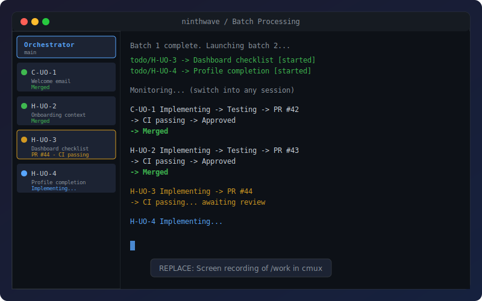
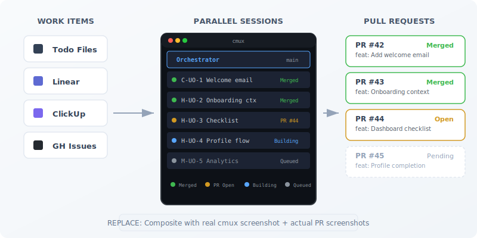
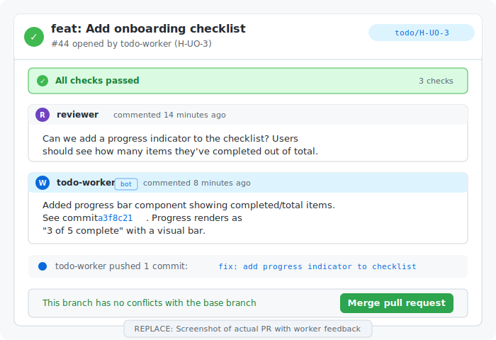

<h1 align="center">ninthwave</h1>

<p align="center">
  <strong>Parallel AI sessions. Human-sized PRs.</strong>
</p>

<p align="center">
  <a href="https://github.com/ninthwave-sh/ninthwave/stargazers"></a>
  <a href="LICENSE"></a>
  <a href="CHANGELOG.md"></a>
  <a href="https://agentskills.io"></a>
</p>

<!-- PLACEHOLDER: docs/assets/hero-demo.gif
     Screen recording of cmux showing /work launching 4 parallel sessions.
     Sidebar shows worker sessions with status progression:
     Implementing → Testing → PR Created → Merged.
     15-20 second loop. -->
<p align="center">
  
</p>

---

**ninthwave is an open-source orchestration layer for AI coding tools.**

Your AI coding tool handles one session at a time. A feature with 8 work items means 8 sequential sessions, 8 rounds of waiting for CI, 8 manual PR flows. You become the bottleneck in your own AI-assisted workflow. And when AI tools do produce PRs, they tend to be sprawling changes that are hard to review.

**ninthwave** decomposes a feature spec into human-sized work items (~200–400 LOC each), then launches parallel AI coding sessions in [cmux](https://cmux.com). Each is a full native instance of Claude Code, OpenCode, or Copilot CLI — same interface, same capabilities. It sequences dependency ordering, monitors CI, dispatches review feedback, and merges. You review every PR before it lands.

Switch into any session mid-flight. ninthwave is the orchestration layer; your tools do the work.

**Built on [cmux](https://cmux.com).** cmux provides composable primitives — terminal, workspaces, splits, notifications, CLI control — and invites developers to build their own workflows on top. ninthwave is our answer to that call: an orchestration layer that turns those primitives into a parallel AI coding pipeline.

## See It Work

```
> /decompose

ninthwave / Feature Decomposition
Project: acme-app (main)

What feature are we breaking down?

> Here's the spec for user onboarding: new users get a welcome email,
> an onboarding checklist on the dashboard, and a profile completion flow.

Exploring codebase...
  Found: lib/mailer.ex (email infrastructure exists)
  Found: lib/accounts/ (user model, no onboarding fields)
  Missing: onboarding context, checklist component, profile completion

Decomposition:

  Batch  ID      Title                           Est. LOC
  ─────  ──────  ──────────────────────────────  ────────
  1      C-UO-1  Add welcome email on signup         ~200
  1      H-UO-2  Create onboarding context           ~300
  2      H-UO-3  Dashboard onboarding checklist      ~350
  2      H-UO-4  Profile completion flow             ~400
  3      M-UO-5  Onboarding analytics events         ~150

5 items across 3 batches written to TODOS.md.


> /work

ninthwave / Batch Processing
Project: acme-app (main)

4 items ready (batches 1–2). How do you want to select?
  A) All ready (4 items)
  B) By feature code
  C) By priority

> a

Dependency analysis:
  Batch 1: C-UO-1, H-UO-2 (parallel, no file conflicts)
  Batch 2: H-UO-3, H-UO-4 (depends on batch 1)

Merge strategy?
  A) Auto-merge once approved + CI passes
  B) Auto-merge ASAP (CI only)
  C) Ask me before each merge

> a

Launching batch 1...
  todo/C-UO-1  → Add welcome email          [session started]
  todo/H-UO-2  → Create onboarding context  [session started]

cmux sidebar shows 2 active sessions. Switch into any one to steer it.

  C-UO-1  Implementing → Testing → PR #42 → CI passing → Approved → Merged
  H-UO-2  Implementing → Testing → PR #43 → CI passing → Approved → Merged

Batch 1 complete. Launching batch 2...
  todo/H-UO-3  → Dashboard checklist        [session started]
  todo/H-UO-4  → Profile completion flow    [session started]

  H-UO-3  Implementing → PR #44 → Review feedback → Fix pushed → Merged
  H-UO-4  Implementing → Testing → PR #45 → CI passing → Approved → Merged

All items merged. Version bump: 1.4.0 → 1.5.0 (CHANGELOG updated)
```

## How It Works

<!-- PLACEHOLDER: docs/assets/pipeline-overview.png
     LEFT: Icons stacked vertically: TODOS.md (markdown icon), Linear, ClickUp, GitHub Issues
     CENTER: Arrows converge into a cmux screenshot showing orchestrator + 4 worker
     sessions in the sidebar with colored status indicators
     RIGHT: GitHub PR list with green merge checkmarks
     Visual: work items in → parallel sessions → PRs out -->
<p align="center">
  
</p>

### `/decompose`: Spec to Work Items

| Phase | What happens |
|-------|-------------|
| **Intake** | Point to a PRD, spec, or describe the feature verbally |
| **Explore** | Scans the codebase: what exists vs. what needs building |
| **Architect** | Optional architecture review for complex features |
| **Decompose** | PR-sized items (~200–400 LOC each), dependencies mapped into batches |
| **Write** | Items written to TODOS.md (or synced to Linear/ClickUp) |

### `/work`: Orchestrate Parallel Sessions

| Phase | What happens |
|-------|-------------|
| **Select** | Choose items by feature, priority, domain, or all-at-once |
| **Launch** | Each item gets a git worktree + full AI coding session via cmux |
| **Monitor** | CI failures dispatched to workers. Review feedback forwarded. Rebases handled. |
| **Merge** | Auto-merge after approval, on CI pass, or confirm each one |
| **Finalize** | Version bump, changelog, cleanup. Offer to continue with next batch. |

## Quick Start

### Install

```bash
brew install ninthwave-sh/tap/ninthwave
```

<details>
<summary>Alternative: install via curl</summary>

```bash
curl -fsSL https://raw.githubusercontent.com/ninthwave-sh/ninthwave/main/install.sh | bash
```
</details>

### Prerequisites

| Dependency | Purpose | Install |
|------------|---------|---------|
| AI coding tool | Runs the sessions | [Claude Code](https://claude.ai/download), [OpenCode](https://opencode.ai), or [Copilot CLI](https://docs.github.com/en/copilot) |
| [cmux](https://cmux.com) | Parallel terminal sessions with visual sidebar | `brew install --cask manaflow-ai/cmux/cmux` |
| [gh](https://cli.github.com) | PR operations | `brew install gh` |

### Set up a project

```bash
cd /path/to/your/project
ninthwave setup
```

One developer runs setup. The team gets everything via `git pull`.

### First run

> Open your AI tool in the project and say:
>
> **`/decompose`** Point it at a spec or describe a feature. It scans your codebase and creates work items.
>
> **`/work`** Select items, set a merge strategy, and watch parallel sessions launch.

## Why ninthwave?

**Your tool, multiplied.** Each session is a full native instance of the AI coding tool you already use. Same interface, same capabilities. Switch into any session via cmux's workspace sidebar, steer it mid-flight, or iterate on a PR. You review every PR before it merges.

**Deterministic orchestration.** One session per work item, dependency-ordered and conflict-checked. Workers idle after opening a PR — no polling, no redundant calls. The orchestrator wakes them for CI fixes or review feedback. Every step is visible and auditable.

**Bring your own agent.** Keep your billing, your interface, your API keys. Workers read your project instructions for conventions — same coding standards, same test commands, same architecture guardrails. No new billing layer, no proxy, no vendor lock-in. Works with Claude Code, OpenCode, Copilot CLI, and anything supporting the [Agent Skills standard](https://agentskills.io).

**Cross-repo by convention.** Work items can target different repositories via a `Repo:` field. Sibling directories resolve automatically — no config file required.

Works for a solo dev decomposing a weekend feature and a team dividing a quarterly milestone.

<!-- PLACEHOLDER: docs/assets/pr-feedback-loop.png
     Shows a GitHub PR titled "feat: Add onboarding checklist (H-UO-3)"
     Visible: a reviewer comment requesting a change, a worker comment responding
     with the fix, CI checks passing after the fix, merge button active.
     Demonstrates: review feedback is automatically dispatched to the right worker
     session. Workers address comments, push fixes, and respond on the PR. -->
<p align="center">
  
</p>

## Reference

### Skills

| Skill | Description |
|-------|-------------|
| `/work` | Orchestrate parallel AI coding sessions for selected work items |
| `/decompose` | Break a feature spec into PR-sized work items with dependency mapping |
| `/todo-preview` | Launch port-isolated dev servers for live testing in worktrees |
| `/ninthwave-upgrade` | Update ninthwave to the latest version |

### CLI

All commands are available via `.ninthwave/work`:

| Command | Description |
|---------|-------------|
| `list [--ready] [--priority P] [--domain D] [--feature F]` | List and filter work items |
| `deps <ID>` | Show dependency chain and dependents |
| `conflicts <ID1> <ID2> ...` | Check file-level and domain overlaps |
| `batch-order <ID1> [ID2] ...` | Group items into dependency-ordered batches |
| `start <ID1> [ID2] ...` | Create worktrees and launch AI sessions |
| `status` | Show active worktree status (branches, PRs, partitions) |
| `watch-ready` | Check PR merge readiness (pending/passing/failing) |
| `autopilot-watch [--interval N]` | Poll for PR status transitions |
| `merged-ids` | List already-merged work items |
| `mark-done <ID1> [ID2] ...` | Remove completed items from TODOS.md |
| `version-bump` | Bump version and generate changelog from commits |
| `clean [ID]` | Remove merged worktrees and close workspaces |
| `repos` | List discovered repos (sibling dirs + repos.conf) |

### Expected skills (bring your own)

Workers reference these skill names during execution. If available, they're used; if not, the worker falls back gracefully.

| Skill | When | Fallback |
|-------|------|----------|
| `/review` | Pre-landing code review | Self-review of the diff |
| `/design-review` | UI/visual changes | Skipped |
| `/qa` | Bug fixes with UI impact | Skipped |
| `/plan-eng-review` | Architecture validation | Skipped |

[gstack](https://github.com/garrytan/gstack) provides all four out of the box. Or bring your own: any skill with the matching name and the [SKILL.md standard](https://agentskills.io) will work.

### Work item backends

| Backend | When to use |
|---------|-------------|
| `TODOS.md` (built-in) | Solo devs, quick projects, everything in markdown |
| Linear, ClickUp, Jira (adapters) | Teams with existing task management |
| GitHub Issues | Lightweight project tracking |

<details>
<summary><strong>What gets installed</strong></summary>

`brew install` places the `ninthwave` binary and resource files (skills, agents, docs) in the Homebrew prefix. `ninthwave setup` creates minimal project-level config.

**Project-level files** (created by `ninthwave setup`, committed to git):

| Path | Purpose |
|------|---------|
| `.ninthwave/work` | CLI shim that calls the ninthwave binary |
| `.ninthwave/dir` | Points to the ninthwave resource directory |
| `.ninthwave/config` | Project settings (LOC extensions, domain mappings) |
| `.ninthwave/domains.conf` | Custom domain slug mappings |
| `.claude/skills/*` | Symlinks to skills (for discovery) |
| `.claude/agents/todo-worker.md` | Worker agent (Claude Code) |
| `.opencode/agents/todo-worker.md` | Worker agent (OpenCode) |
| `.github/agents/todo-worker.agent.md` | Worker agent (Copilot CLI) |
| `TODOS.md` | Work items (created if missing) |

</details>

## Updating

Run `/ninthwave-upgrade` from any AI coding session, or manually:

```bash
brew upgrade ninthwave
ninthwave setup   # re-sync project-level files
```

Project-specific config (`TODOS.md`, `.ninthwave/config`, `domains.conf`) is preserved.

## Contributing

See [CONTRIBUTING.md](CONTRIBUTING.md) for development setup, architecture, and how the pieces fit together.

## License

MIT. See [LICENSE](LICENSE).
