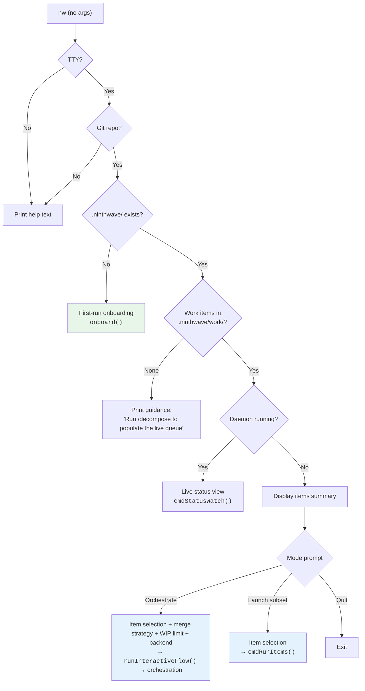
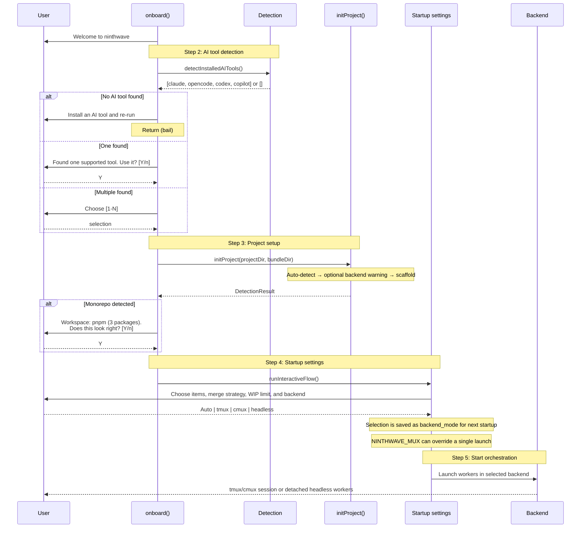
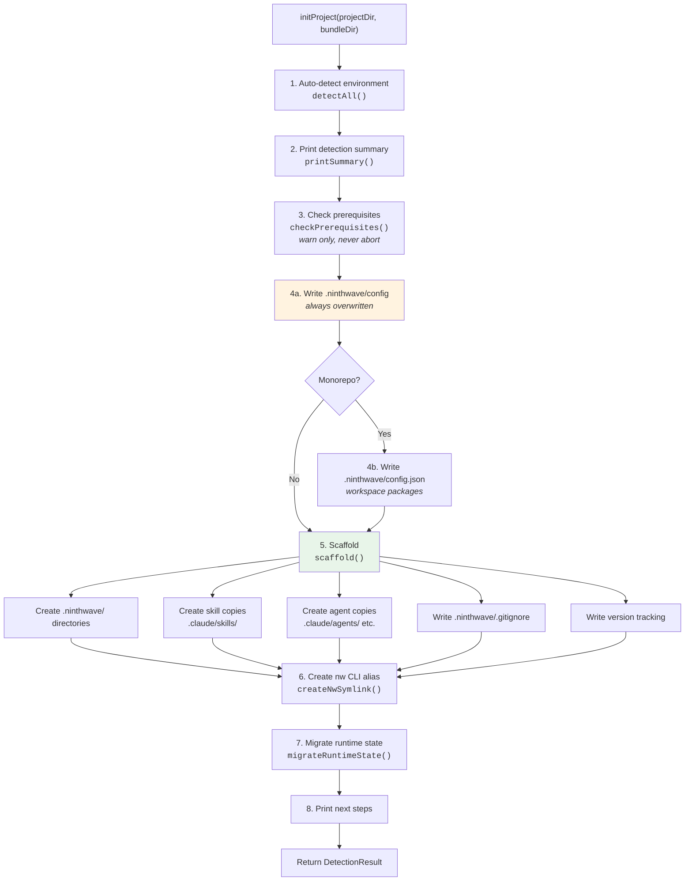
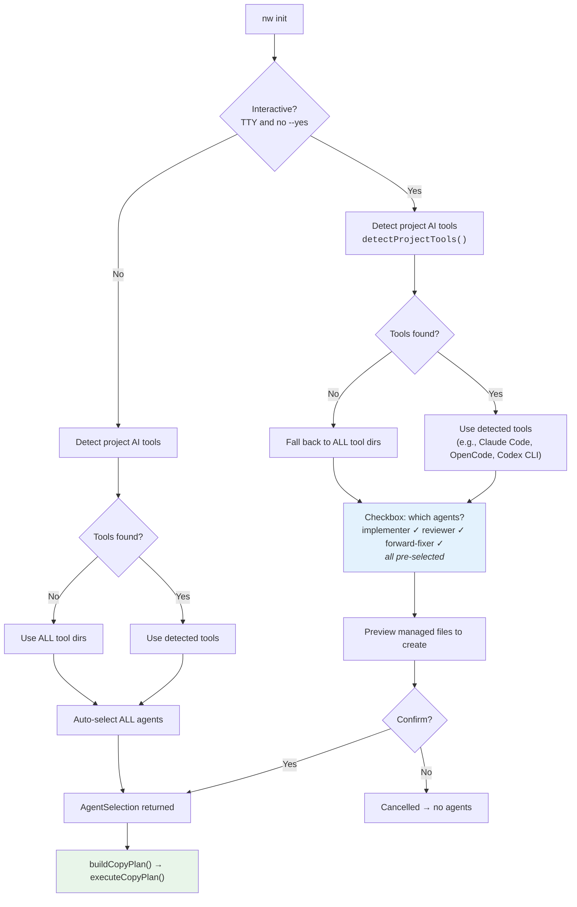

# Onboarding Process

How ninthwave initialises a project -- every entry point, decision, file, and generated managed copy.

## Entry Points

There are two ways onboarding runs:

| Entry Point | When | Interactive? | Source |
|---|---|---|---|
| `nw` (no args, first run) | User runs `nw` in a git repo with no `.ninthwave/` dir | Yes (TTY required) | `core/commands/onboard.ts` → `onboard()` |
| `nw init` | User explicitly runs init | Yes by default, `--yes` for non-interactive | `core/commands/init.ts` → `cmdInit()` |
| `nw init --global` | User wants global skills only | Minimal | `core/commands/setup.ts` → `setupGlobal()` |

Both paths converge on the same `initProject()` function for the actual setup work. The difference is that `nw` (no-args) wraps it in an interactive guided flow with AI tool selection, setup, and startup settings (including backend selection) before orchestration begins.

The queue mental model is intentional: `/decompose` (or manual file creation) populates `.ninthwave/work/`, `nw` works through that live queue, and completed work is looked up through merged PRs, `nw history`, `nw logs`, or git history rather than retained in a `done` lane under `.ninthwave/work/`.

---

## 1. User Journey: `nw` No-Args Routing

When a user runs `nw` with no arguments, `cmdNoArgs()` detects the project state and routes accordingly.



**Source:** `core/commands/onboard.ts:428-532`

---

## 2. Interactive Onboarding Flow

When `onboard()` runs (first-run via `nw` no-args), it guides the user through tool detection and project setup. After that, the regular startup settings flow takes over and the user chooses how to launch orchestration.



**Source:** `core/commands/onboard.ts:229-391`

---

## 3. `initProject()` Internal Pipeline

Both entry points converge here. This is the core setup logic.



**Source:** `core/commands/init.ts:823-891`

---

## 4. Agent Selection Flow

How agents get selected differs between interactive and non-interactive mode.



**Tool detection logic** (`core/commands/setup.ts:266-290`):

| AI Tool | Detection | Target Directory | Filename Suffix |
|---|---|---|---|
| Claude Code | `.claude/` exists | `.claude/agents/` | `.md` |
| OpenCode | `.opencode/` or `.opencode.json` exists | `.opencode/agents/` | `.md` |
| Codex CLI | `.codex/agents/` exists | `.codex/agents/` | `.toml` (prefixed `ninthwave-`) |
| GitHub Copilot | `.github/copilot-instructions.md` (user-managed) or `.github/agents/` exists | `.github/agents/` | `.agent.md` (prefixed `ninthwave-`) |

---

## 5. Auto-Detection Reference

`detectAll()` runs these detectors and returns a `DetectionResult`:

| What | How | Config Key | Stored In |
|---|---|---|---|
| CI provider | `.github/workflows/*.{yml,yaml}` exists | `ci_provider` | `.ninthwave/config` |
| Test command | `package.json` scripts: `test:ci` > `test` > first `test*` | `test_command` | `.ninthwave/config` |
| Interactive backend | `which cmux`, else `which tmux` | *(none persisted by init)* | detection summary only |
| AI tools | `.claude/`, `.opencode/`, `.codex/agents/`, `.github/copilot-instructions.md` (user-managed), `.github/agents/` | `AI_TOOLS` | `.ninthwave/config` |
| Repo type | `package.json` workspaces or `pnpm-workspace.yaml` | `REPO_TYPE` | `.ninthwave/config` |
| Workspace config | Resolve workspace globs → packages list, detect turbo | *(structured)* | `.ninthwave/config.json` |
| Observability | `SENTRY_AUTH_TOKEN`, `PAGERDUTY_API_TOKEN`, `LINEAR_API_KEY` env vars | *(informational)* | *(summary only)* |

**Source:** `core/commands/init.ts:117-516`

---

## 6. File Manifest

Every file and directory created during onboarding, plus the user-managed instruction inputs that init reads but does not own:

### Project-level (`.ninthwave/`)

| Path | Type | When Created | Overwritten on Re-init? | Git-tracked? | Purpose |
|---|---|---|---|---|---|
| `.ninthwave/` | Directory | Always | N/A | Yes | Project config root |
| `.ninthwave/config` | File | Always | **Yes** (authoritative) | Yes | Auto-detected environment settings (INI format) |
| `.ninthwave/config.json` | File | Only if monorepo detected | **Yes** | Yes | Structured workspace package list |
| `.ninthwave/domains.conf` | File | Only if missing | **No** (preserved) | Yes | Domain pattern mappings for work item filtering |
| `.ninthwave/work/` | Directory | Always | N/A | Yes | Live queue of open work item markdown files |
| `.ninthwave/work/.gitkeep` | File | Always | Yes | Yes | Keeps empty dir in git |
| `.ninthwave/friction/` | Directory | Always | N/A | Yes | Friction log entries |
| `.ninthwave/friction/.gitkeep` | File | Always | Yes | Yes | Keeps empty dir in git |
| `.ninthwave/schedules/` | Directory | Always | N/A | Yes | Scheduled task definitions |
| `.ninthwave/schedules/ci--example-daily-audit.md` | File | Only on fresh init (dir is new) | **No** | Yes | Example disabled schedule |

### Managed tool copies (tool integration)

| Path | Type | When Created | Overwritten on Re-init? | Git-tracked? | Purpose |
|---|---|---|---|---|---|
| `.claude/skills/decompose/` | Directory | Always | Yes (re-copied) | Repo policy | `/decompose` skill |
| `.claude/agents/implementer.md` | File | If Claude Code selected | Yes (refreshed) | Repo policy | Implementation agent prompt |
| `.claude/agents/reviewer.md` | File | If Claude Code selected | Yes (refreshed) | Repo policy | PR review agent prompt |
| `.claude/agents/forward-fixer.md` | File | If Claude Code selected | Yes (refreshed) | Repo policy | CI fix-forward agent prompt |
| `.opencode/agents/implementer.md` | File | If OpenCode selected | Yes (refreshed) | Repo policy | Implementation agent prompt |
| `.opencode/agents/reviewer.md` | File | If OpenCode selected | Yes (refreshed) | Repo policy | PR review agent prompt |
| `.opencode/agents/forward-fixer.md` | File | If OpenCode selected | Yes (refreshed) | Repo policy | CI fix-forward agent prompt |
| `.codex/agents/ninthwave-implementer.toml` | File | If Codex CLI selected | Yes (refreshed) | Repo policy | Implementation agent prompt rendered as Codex TOML |
| `.codex/agents/ninthwave-reviewer.toml` | File | If Codex CLI selected | Yes (refreshed) | Repo policy | PR review agent prompt rendered as Codex TOML |
| `.codex/agents/ninthwave-forward-fixer.toml` | File | If Codex CLI selected | Yes (refreshed) | Repo policy | CI fix-forward agent prompt rendered as Codex TOML |
| `.github/agents/ninthwave-implementer.agent.md` | File | If Copilot selected | Yes (refreshed) | Repo policy | Implementation agent prompt |
| `.github/agents/ninthwave-reviewer.agent.md` | File | If Copilot selected | Yes (refreshed) | Repo policy | PR review agent prompt |
| `.github/agents/ninthwave-forward-fixer.agent.md` | File | If Copilot selected | Yes (refreshed) | Repo policy | CI fix-forward agent prompt |
| `AGENTS.md` | File | Never created by ninthwave | Never | Repo policy | User-managed project instructions (read-only input) |
| `.github/copilot-instructions.md` | File | Never created by ninthwave | Never | Repo policy | User-managed Copilot project instructions (read-only input) |

### Other project files

| Path | Type | When Created | Overwritten on Re-init? | Git-tracked? | Purpose |
|---|---|---|---|---|---|
| `.ninthwave/.gitignore` | File | Always if missing | Preserved after first write | Yes | Deny-by-default rules for committed ninthwave state |

### User-level (`~/.ninthwave/`)

| Path | Type | When Created | Git-tracked? | Purpose |
|---|---|---|---|---|
| `~/.ninthwave/projects/{slug}/` | Directory | Always | N/A | Per-project runtime state |
| `~/.ninthwave/projects/{slug}/version` | File | Always | N/A | ninthwave version used at init |

Slug formula: project root path with `/` replaced by `-` (e.g., `/Users/rob/code/proj` → `-Users-rob-code-proj`).

### System-level

| Path | Type | When Created | Purpose |
|---|---|---|---|
| `{NINTHWAVE_BIN_DIR}/nw` | Symlink | If `nw` not already in PATH | Short alias: `nw` → `ninthwave` |

### Global mode only (`nw init --global`)

| Path | Type | Purpose |
|---|---|---|
| `~/.claude/skills/decompose/` | Directory | Global `/decompose` skill |
| `~/.claude/skills/decompose/` | Directory | Global `/decompose` skill |

No project-level files are created in global mode.

---

## 7. Directory Tree

Resulting project structure after `nw init` in a project with Claude Code, OpenCode, Codex CLI, and Copilot detected:

```
project-root/
├── .ninthwave/                          # git-tracked
│   ├── config                           # auto-detected settings (INI)
│   ├── config.json                      # workspace packages (monorepo only)
│   ├── domains.conf                     # domain mappings (preserved)
│   ├── work/                            # work item files
│   │   └── .gitkeep
│   ├── friction/                        # friction log
│   │   └── .gitkeep
│   └── schedules/                       # scheduled tasks
│       └── ci--example-daily-audit.md   # example (fresh init only)
│
├── .claude/
│   ├── agents/                          # ← managed copies
│   │   ├── implementer.md
│   │   ├── reviewer.md
│   │   └── forward-fixer.md
│   └── skills/                          # ← managed copies
│       ├── work/
│       │   └── SKILL.md
│       └── decompose/
│           └── SKILL.md
│
├── .opencode/                           # managed copies (if detected)
│   └── agents/
│       ├── implementer.md
│       ├── reviewer.md
│       └── forward-fixer.md
│
├── .codex/                              # managed copies (if detected)
│   └── agents/
│       ├── ninthwave-implementer.toml
│       ├── ninthwave-reviewer.toml
│       └── ninthwave-forward-fixer.toml
│
├── .github/                             # regular repo metadata + managed copies
│   ├── agents/
│   │   ├── ninthwave-implementer.agent.md
│   │   ├── ninthwave-reviewer.agent.md
│   │   └── ninthwave-forward-fixer.agent.md
│   └── copilot-instructions.md          # optional user-managed Copilot instructions
│
├── AGENTS.md                            # optional user-managed project instructions
├── .gitignore                           # repo-local policy (optional)
└── .worktrees/                          # created later by orchestrator, gitignored
```

By default, `nw init` writes portable managed copies into the project. In the ninthwave repo itself, those generated copies are ignored so only the canonical sources in `skills/`, `agents/`, and `CLAUDE.md` stay tracked. Project instruction files such as `CLAUDE.md`, `AGENTS.md`, and `.github/copilot-instructions.md` remain user-owned inputs; init reads them but never creates, refreshes, or prunes them. For Codex, the managed boundary is `.codex/agents/ninthwave-*.toml` only.

---

## 8. Ignore Files and Tracking Policy

Init always creates `.ninthwave/.gitignore` with deny-by-default rules for ninthwave's own committed state:

```gitignore
# Deny by default -- only explicitly allowed files are committed
*

# Committed project files
!.gitignore
!config.json
!work/
!work/**
!schedules/
!schedules/**
!friction/
!friction/**
```

`nw init` does **not** modify the repo root `.gitignore`.

If a project wants generated tool copies to stay untracked, add repo-local root ignore rules manually. The ninthwave repo does this because it tracks only the canonical sources and regenerates tool copies locally:

```gitignore
/.claude/agents/
/.claude/skills/
/.opencode/agents/
/.codex/agents/
/.github/agents/
```

That root-level ignore policy is specific to the ninthwave repo itself, not a universal rule for user repositories.

**Source:** `core/commands/init.ts:756-796`, `core/commands/setup.ts:206-219`

---

## 9. Modes & Flags

### `nw init`
Standard project init. Interactive by default (prompts for agent selection). Runs full auto-detect + scaffold pipeline.

### `nw init --yes` / `nw init -y`
Non-interactive. Skips agent selection prompt -- auto-selects all discovered agents into all detected tool directories (or all tool directories if none detected).

### `nw init --global`
Global-only mode. Creates `~/.claude/skills/` managed copies and returns. No `.ninthwave/` directory, no project agent files, no repo `.gitignore` changes, no project setup.

### `nw` (no args, first run)
Interactive guided onboarding. Detects an AI tool, runs `initProject()`, then drops into the normal startup settings flow where the user can choose `Auto`, `tmux`, `cmux`, or `headless`. Only triggers when `.ninthwave/` does not exist.

---

## 10. Legacy Migration

If `.ninthwave/todos/` exists (pre-rename), init migrates files to `.ninthwave/work/` and removes the old directory. Only happens if `.ninthwave/work/` does not already exist.

This is an intentional compatibility boundary, not a stray old name: keep `.ninthwave/todos/` references in init code and migration docs until support for pre-rename repos is deliberately removed. Likewise, older docs or review notes that mention `TODOS.md` / `todo` should be treated as historical records unless they are being rewritten as current guidance.

For the full keep-list of `todo` names that are protocol-, compatibility-, or history-sensitive, see [work-item terminology boundaries](work-item-terminology.md).

**Source:** `core/commands/init.ts:691-709`

---

## 11. Idempotency

Running `nw init` multiple times is safe:

| Artifact | Behavior on Re-init |
|---|---|
| `.ninthwave/config` | Overwritten (init is authoritative for detection) |
| `.ninthwave/config.json` | Overwritten if monorepo detected |
| `.ninthwave/domains.conf` | Preserved (user configuration) |
| `.ninthwave/work/`, `friction/`, `schedules/` | Directories ensured, contents preserved |
| Schedule example file | Only created if `schedules/` dir is new |
| Skill managed copies | Re-copied from the canonical bundle |
| Agent managed copies | Refreshed when stale, left alone when already current |
| `AGENTS.md` | Preserved as a user-managed input if present; never written or pruned by init |
| `.github/copilot-instructions.md` | Preserved as a user-managed input if present; never written or pruned by init |
| `.ninthwave/.gitignore` | Written once if missing, then preserved |
| `nw` CLI alias | Skipped if already in PATH |

---

## 12. Prerequisite Checks

Init checks for external tools but **never aborts** -- warnings only. `gh` is required for PR workflows; interactive backends are optional because headless works by default.

| Tool | Check | Install Command | Purpose |
|---|---|---|---|
| `gh` | `which gh` | `brew install gh` | GitHub PR operations |
| `tmux` *(optional)* | `which tmux` | `brew install tmux` | Attachable interactive backend |
| `cmux` *(optional)* | `which cmux` | `brew install --cask manaflow-ai/cmux/cmux` | Attachable interactive backend with richer macOS UI |
| `gh auth` | `gh auth status` | `gh auth login` | GitHub authentication (only checked if `gh` is present) |

**Source:** `core/commands/setup.ts:103-159`
