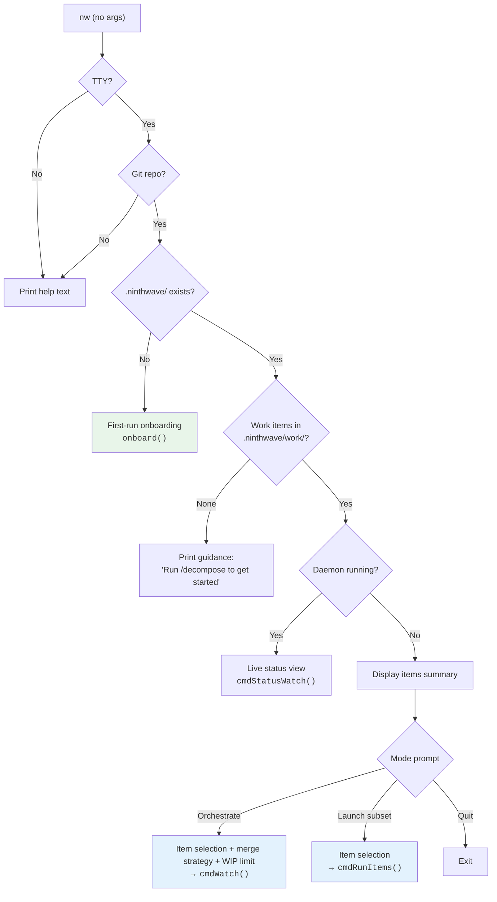
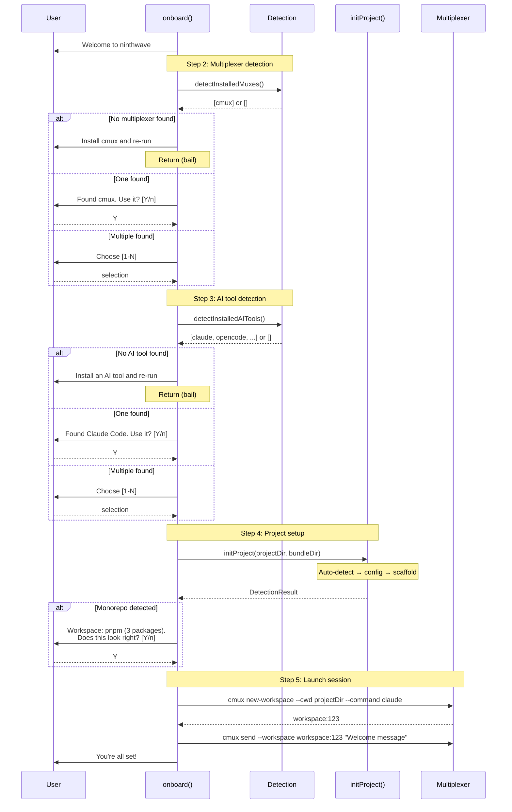
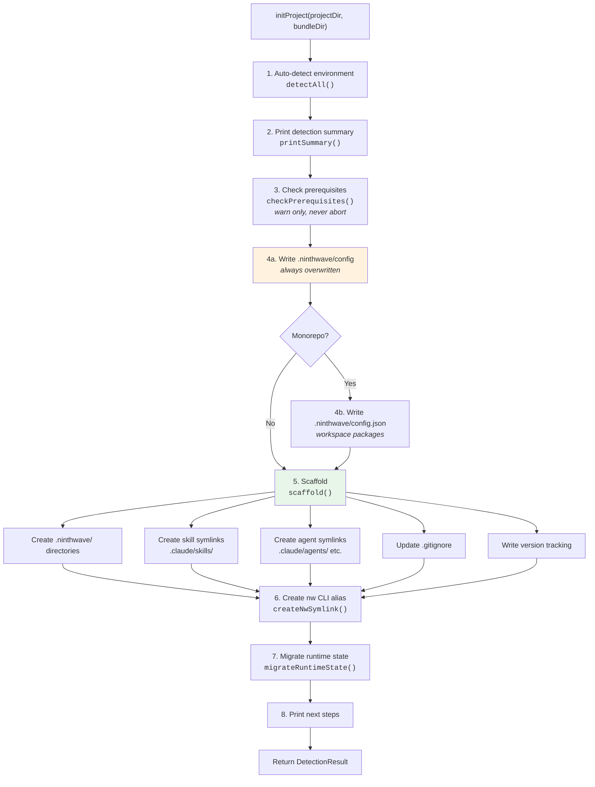
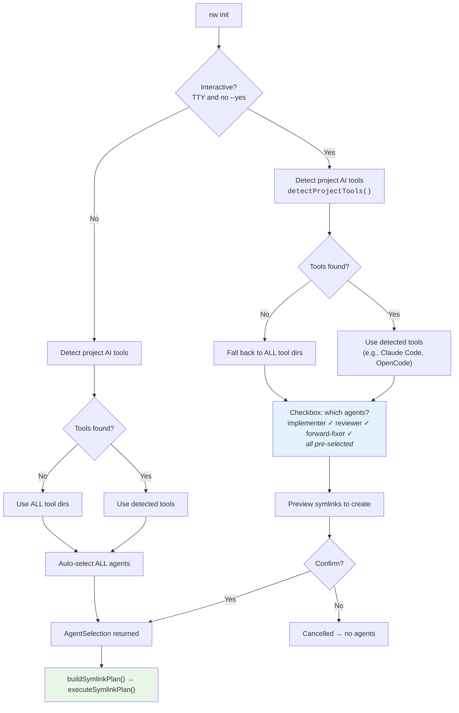

# Onboarding Process

How ninthwave initialises a project -- every entry point, decision, file, and symlink.

## Entry Points

There are two ways onboarding runs:

| Entry Point | When | Interactive? | Source |
|---|---|---|---|
| `nw` (no args, first run) | User runs `nw` in a git repo with no `.ninthwave/` dir | Yes (TTY required) | `core/commands/onboard.ts` → `onboard()` |
| `nw init` | User explicitly runs init | Yes by default, `--yes` for non-interactive | `core/commands/init.ts` → `cmdInit()` |
| `nw init --global` | User wants global skills only | Minimal | `core/commands/setup.ts` → `setupGlobal()` |

Both paths converge on the same `initProject()` function for the actual setup work. The difference is that `nw` (no-args) wraps it in an interactive guided flow with multiplexer/AI tool selection and session launch.

---

## 1. User Journey: `nw` No-Args Routing

When a user runs `nw` with no arguments, `cmdNoArgs()` detects the project state and routes accordingly.



**Source:** `core/commands/onboard.ts:428-532`

---

## 2. Interactive Onboarding Flow

When `onboard()` runs (first-run via `nw` no-args), it guides the user through tool detection and project setup before launching a session.



**Source:** `core/commands/onboard.ts:229-391`

---

## 3. `initProject()` Internal Pipeline

Both entry points converge here. This is the core setup logic.



**Source:** `core/commands/init.ts:823-891`

---

## 4. Agent Selection Flow

How agents get selected differs between interactive and non-interactive mode.



**Tool detection logic** (`core/commands/setup.ts:266-290`):

| AI Tool | Detection | Target Directory | Symlink Suffix |
|---|---|---|---|
| Claude Code | `.claude/` exists | `.claude/agents/` | `.md` |
| OpenCode | `.opencode/` or `.opencode.json` exists | `.opencode/agents/` | `.md` |
| GitHub Copilot | `.github/` exists | `.github/agents/` | `.agent.md` (prefixed `ninthwave-`) |

---

## 5. Auto-Detection Reference

`detectAll()` runs these detectors and returns a `DetectionResult`:

| What | How | Config Key | Stored In |
|---|---|---|---|
| CI provider | `.github/workflows/*.{yml,yaml}` exists | `ci_provider` | `.ninthwave/config` |
| Test command | `package.json` scripts: `test:ci` > `test` > first `test*` | `test_command` | `.ninthwave/config` |
| Multiplexer | `which cmux` succeeds | `MUX` | `.ninthwave/config` |
| AI tools | `.claude/`, `.opencode/`, `.github/copilot-instructions.md` | `AI_TOOLS` | `.ninthwave/config` |
| Repo type | `package.json` workspaces or `pnpm-workspace.yaml` | `REPO_TYPE` | `.ninthwave/config` |
| Workspace config | Resolve workspace globs → packages list, detect turbo | *(structured)* | `.ninthwave/config.json` |
| Observability | `SENTRY_AUTH_TOKEN`, `PAGERDUTY_API_TOKEN`, `LINEAR_API_KEY` env vars | *(informational)* | *(summary only)* |

**Source:** `core/commands/init.ts:117-516`

---

## 6. File Manifest

Every file and directory created during onboarding:

### Project-level (`.ninthwave/`)

| Path | Type | When Created | Overwritten on Re-init? | Git-tracked? | Purpose |
|---|---|---|---|---|---|
| `.ninthwave/` | Directory | Always | N/A | Yes | Project config root |
| `.ninthwave/config` | File | Always | **Yes** (authoritative) | Yes | Auto-detected environment settings (INI format) |
| `.ninthwave/config.json` | File | Only if monorepo detected | **Yes** | Yes | Structured workspace package list |
| `.ninthwave/domains.conf` | File | Only if missing | **No** (preserved) | Yes | Domain pattern mappings for work item filtering |
| `.ninthwave/work/` | Directory | Always | N/A | Yes | Work item markdown files |
| `.ninthwave/work/.gitkeep` | File | Always | Yes | Yes | Keeps empty dir in git |
| `.ninthwave/friction/` | Directory | Always | N/A | Yes | Friction log entries |
| `.ninthwave/friction/.gitkeep` | File | Always | Yes | Yes | Keeps empty dir in git |
| `.ninthwave/schedules/` | Directory | Always | N/A | Yes | Scheduled task definitions |
| `.ninthwave/schedules/ci--example-daily-audit.md` | File | Only on fresh init (dir is new) | **No** | Yes | Example disabled schedule |

### Symlinks (tool integration)

| Path | Type | When Created | Overwritten on Re-init? | Git-tracked? | Purpose |
|---|---|---|---|---|---|
| `.claude/skills/work` | Symlink | Always | Yes (recreated) | **No** (gitignored) | `/work` skill |
| `.claude/skills/decompose` | Symlink | Always | Yes (recreated) | **No** (gitignored) | `/decompose` skill |
| `.claude/skills/ninthwave-upgrade` | Symlink | Always | Yes (recreated) | **No** (gitignored) | `/ninthwave-upgrade` skill |
| `.claude/agents/implementer.md` | Symlink | If Claude Code selected | Yes (recreated) | **No** (gitignored) | Implementation agent prompt |
| `.claude/agents/reviewer.md` | Symlink | If Claude Code selected | Yes (recreated) | **No** (gitignored) | PR review agent prompt |
| `.claude/agents/forward-fixer.md` | Symlink | If Claude Code selected | Yes (recreated) | **No** (gitignored) | CI fix-forward agent prompt |
| `.opencode/agents/implementer.md` | Symlink | If OpenCode selected | Yes (recreated) | **No** (gitignored) | Implementation agent prompt |
| `.opencode/agents/reviewer.md` | Symlink | If OpenCode selected | Yes (recreated) | **No** (gitignored) | PR review agent prompt |
| `.opencode/agents/forward-fixer.md` | Symlink | If OpenCode selected | Yes (recreated) | **No** (gitignored) | CI fix-forward agent prompt |
| `.github/agents/ninthwave-implementer.agent.md` | Symlink | If Copilot selected | Yes (recreated) | **No** (gitignored) | Implementation agent prompt |
| `.github/agents/ninthwave-reviewer.agent.md` | Symlink | If Copilot selected | Yes (recreated) | **No** (gitignored) | PR review agent prompt |
| `.github/agents/ninthwave-forward-fixer.agent.md` | Symlink | If Copilot selected | Yes (recreated) | **No** (gitignored) | CI fix-forward agent prompt |

### Other project files

| Path | Type | When Created | Overwritten on Re-init? | Git-tracked? | Purpose |
|---|---|---|---|---|---|
| `.gitignore` | File | Created if missing, appended if exists | Appended (deduped) | Yes | Excludes `.worktrees/` and symlink dirs |

### User-level (`~/.ninthwave/`)

| Path | Type | When Created | Git-tracked? | Purpose |
|---|---|---|---|---|
| `~/.ninthwave/projects/{slug}/` | Directory | Always | N/A | Per-project runtime state |
| `~/.ninthwave/projects/{slug}/version` | File | Always | N/A | ninthwave version used at init |

Slug formula: project root path with `/` replaced by `-` (e.g., `/Users/rob/code/proj` → `-Users-rob-code-proj`).

### System-level

| Path | Type | When Created | Purpose |
|---|---|---|---|
| `{NINTHWAVE_BIN_DIR}/nw` | Symlink | If `nw` not already in PATH | Short alias: `nw` → `ninthwave` |

### Global mode only (`nw init --global`)

| Path | Type | Purpose |
|---|---|---|
| `~/.claude/skills/work` | Symlink | Global `/work` skill |
| `~/.claude/skills/decompose` | Symlink | Global `/decompose` skill |
| `~/.claude/skills/ninthwave-upgrade` | Symlink | Global `/ninthwave-upgrade` skill |

No project-level files are created in global mode.

---

## 7. Directory Tree

Resulting project structure after `nw init` in a project with Claude Code and OpenCode detected:

```
project-root/
├── .ninthwave/                          # git-tracked
│   ├── config                           # auto-detected settings (INI)
│   ├── config.json                      # workspace packages (monorepo only)
│   ├── domains.conf                     # domain mappings (preserved)
│   ├── work/                            # work item files
│   │   └── .gitkeep
│   ├── friction/                        # friction log
│   │   └── .gitkeep
│   └── schedules/                       # scheduled tasks
│       └── ci--example-daily-audit.md   # example (fresh init only)
│
├── .claude/                             # gitignored subdirs
│   ├── agents/                          # ← symlinks, gitignored
│   │   ├── implementer.md  → ../../ninthwave/agents/implementer.md
│   │   ├── reviewer.md     → ../../ninthwave/agents/reviewer.md
│   │   └── forward-fixer.md     → ../../ninthwave/agents/forward-fixer.md
│   └── skills/                          # ← symlinks, gitignored
│       ├── work             → ../../ninthwave/skills/work
│       ├── decompose        → ../../ninthwave/skills/decompose
│       └── ninthwave-upgrade → ../../ninthwave/skills/ninthwave-upgrade
│
├── .opencode/                           # gitignored subdirs (if detected)
│   └── agents/                          # ← symlinks, gitignored
│       ├── implementer.md  → ../../ninthwave/agents/implementer.md
│       ├── reviewer.md     → ../../ninthwave/agents/reviewer.md
│       └── forward-fixer.md     → ../../ninthwave/agents/forward-fixer.md
│
├── .github/                             # gitignored agents/ subdir (if detected)
│   └── agents/                          # ← symlinks, gitignored
│       ├── ninthwave-implementer.agent.md → ...
│       ├── ninthwave-reviewer.agent.md    → ...
│       └── ninthwave-forward-fixer.agent.md    → ...
│
├── .gitignore                           # appended with ninthwave entries
└── .worktrees/                          # created later by orchestrator, gitignored
```

Symlink targets are relative paths (e.g., `../../../path/to/ninthwave/agents/implementer.md`) computed from each link's parent directory back to the ninthwave bundle. This ensures portability across directory moves and Homebrew prefix changes.

---

## 8. `.gitignore` Entries

Init adds these entries (deduped, appended if `.gitignore` exists, created if not):

```gitignore
# ninthwave worktrees
.worktrees/

# ninthwave symlinks (developer-local, re-created by ninthwave init)
.claude/agents/
.claude/skills/
.opencode/agents/
.github/agents/
```

**Self-hosting exception:** When `projectDir === bundleDir` (ninthwave developing itself), the symlink entries are **not** added since those directories contain source files, not symlinks.

**Source:** `core/commands/init.ts:756-796`, `core/commands/setup.ts:206-219`

---

## 9. Modes & Flags

### `nw init`
Standard project init. Interactive by default (prompts for agent selection). Runs full auto-detect + scaffold pipeline.

### `nw init --yes` / `nw init -y`
Non-interactive. Skips agent selection prompt -- auto-selects all discovered agents into all detected tool directories (or all tool directories if none detected).

### `nw init --global`
Global-only mode. Creates `~/.claude/skills/` symlinks and returns. No `.ninthwave/` directory, no agent symlinks, no `.gitignore` changes, no project setup.

### `nw` (no args, first run)
Interactive guided onboarding. Detects multiplexer and AI tool, runs `initProject()`, then launches a session in the multiplexer with a welcome message. Only triggers when `.ninthwave/` does not exist.

---

## 10. Legacy Migration

If `.ninthwave/todos/` exists (pre-rename), init migrates files to `.ninthwave/work/` and removes the old directory. Only happens if `.ninthwave/work/` does not already exist.

**Source:** `core/commands/init.ts:691-709`

---

## 11. Idempotency

Running `nw init` multiple times is safe:

| Artifact | Behavior on Re-init |
|---|---|
| `.ninthwave/config` | Overwritten (init is authoritative for detection) |
| `.ninthwave/config.json` | Overwritten if monorepo detected |
| `.ninthwave/domains.conf` | Preserved (user configuration) |
| `.ninthwave/work/`, `friction/`, `schedules/` | Directories ensured, contents preserved |
| Schedule example file | Only created if `schedules/` dir is new |
| Skill symlinks | Removed and recreated (always current) |
| Agent symlinks | Recreated; existing correct symlinks reported as "already set up" |
| `.gitignore` | Appended only if entries missing (deduped) |
| `nw` CLI alias | Skipped if already in PATH |

---

## 12. Prerequisite Checks

Init checks for external tools but **never aborts** -- warnings only.

| Tool | Check | Install Command | Purpose |
|---|---|---|---|
| `gh` | `which gh` | `brew install gh` | GitHub PR operations |
| `cmux` | `which cmux` | `brew install --cask manaflow-ai/cmux/cmux` | Terminal multiplexer for parallel sessions |
| `gh auth` | `gh auth status` | `gh auth login` | GitHub authentication (only checked if `gh` is present) |

**Source:** `core/commands/setup.ts:103-159`
